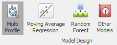

# Releases

## Version 4.0 (March 2019)

This release sees a wide range of changes across the board, with a focus on ease of use as well as better support for interval level forecasting. Forecaster is now 64 bit, which allows the handling of larger projects and models.

These are the changes with respect to the previous Forecaster version 3.3.

### Headlines

1.	Interval level forecasts are better supported, including improved charts
2.	Improved user interface, bringing the recommended forecast models to the fore. This makes choosing the correct model even easier, even for occasional users. The recommended initial model is selected by default:

3.	The most suitable models for the data type are automatically offered. For instance, with interval level data, the Smoothed Profile model is selected by default
4.	The original 3 Forecaster models (Neural Networks, Decision Trees, and Regression) have been dropped in favour of more accurate models specifically tailored for time series analysis. Legacy models in existing projects will automatically be ported to the most suitable new model.
5.	Move to 64 bit software: larger projects and larger forests of decision trees are now possible due to better memory usage.
6.	New Export Data external process allows more control over data export, including selecting forecast range only, and exporting to Excel format.
7.	US date compatibility added (tick box in the Load With Harmonics importers)
8.	Random Forests now have an option to run on binary (0/1) data, allowing the use for propensity modelling such as churn or sales propensity.

### Usability
1.	A new Model tab now holds all the modelling related functionality, to declutter the user interface.
2.	New buttons for quick single-click data re-importation, and a single Forecast button replaces the old Train and Forecast buttons:
3.	Many options that required a right-click are now more accessible through the Data tab ribbon
4.	The forecast period now runs by default to the end of the dataset, avoiding the need to manually set the forecast length

### Other
1.	Manual overlays added to all forecast models
2.	New ability to provide more accurate forecasts, by combining forecasts from different projects. When reading in forecasts from other projects, an option has been added to read in forecasts for all rows (in previous versions, actuals were automatically read in instead where available). This now means that multiple forecasts can be read in to a single project, and used as inputs in a forecast model (typically a Random Forest). This combined forecasting model will produce an improved forecast, by combining the best parts of each of the original forecasts.
3.	Option added to the standard Load With Harmonics importers to manually specify the number of working days in the week. (This was previously inferred from the input data, which was not always robust.)
4.	Simpler installation through a more integrated R environment – this should also minimise R package loading issues some users experienced in v3.3
5.	Black surround removed from chart image copying
6.	Public holiday data updated up to 2025, for a core range of countries (others available on request)

## Version 3.3 (July 2017)

This release sees the introduction of new interval level models, as well as the ability to add in manual forecast overlays. Links between projects have been added, so you can now read in forecasts from one project into another. Installation is now extremely simple, through a completely integrated R environment.

These changes are since version 3.1, v3.2 being an internal release.

### Headlines

1. Interval level Smoothed Profile models are added, which give more weight to recent weeks, and also let you add in a proportion of the previous years’ profile. This can be helpful in modelling seasonal changes with minimal lag
2. Interval level Principal Components models are added. These work in a very different way, by determining a set of standard weekly profiles, then creating forecasts as a weighted combination of those profiles. This allows the use of different profiles at different times of year, or different intraday profiles in public holiday periods
3. All interval profile models can now be used to match daily (or weekly) totals provided by another model
4. Forecasts can be read in from other projects. This can be especially helpful when a business driver is not known into the future. Forecasts can be created for this driver in a separate project, and can then be read into the main project to use as an input
5. Manual overlays can be applied to the main models, in order to overlay additional business knowledge on top of the data-driven forecasts
6. Simpler installation through a completely integrated R environment

### Usability

1. Ability to freeze columns in the data grid – especially useful for interval level modelling, when you want to keep track of date and time as you scroll across the table
2. New data columns can now be added within Forecaster: useful for creating manual data overlays
3. When setting up data exporters in a workflow, column selection is now much more flexible, and columns can be specified wither by index or by type (Target, Input, Forecast, etc.)…

### Other

1. External Processes have been added to workflows, so any custom exports or other processes can be automated

## Version 3.2 (June 2017)
Internal release.

This release sees the introduction of new interval level models, as well as the ability to add in manual forecast overlays. Links between projects have been added, so you can now read in forecasts from one project into another.

### Headlines

1. Interval level Smoothed Profile models are added, which give more weight to recent weeks, and also let you add in a proportion of the previous years’ profile. This can be helpful in modelling seasonal changes with minimal lag.
2. Interval level Principal Components models are added. These work in a very different way, by determining a set of standard weekly profiles, then creating forecasts as a weighted combination of those profiles. This allows the use of different profiles at different times of year, or different intraday profiles in public holiday periods.
3. All interval profile models can now be used to match daily (or weekly) totals provided by another model
4. Forecasts can be read in from other projects. This can be especially helpful when a business driver is not known into the future. Forecasts can be created for this driver in a separate project, and can then be read into the main project to use as an input.
5. Manual overlays can be applied to the main models, in order to overlay additional business knowledge on top of the data-driven forecasts.

### Usability

1. Ability to freeze columns in the data grid –especially useful for interval level modelling, when you want to keep track of date and time as you scroll across the table
2. New data columns can now be added within Forecaster: useful for creating manual data overlays
3. When setting up data exporters in a workflow, column selection is now much more flexible, and columns can be specified wither by index or by type (Target, Input, Forecast, etc.)…

### Other

1. External Processes have been added to workflows, so any custom exports or other processes can be automated

## Version 3.0 (February 2016)

This release has a large number of improvements across the board, with new workflow functionality as well as better and more integrated custom models. In addition, we’ve also made a wide range of other improvements and bug fixes, and public holidays are now available for a number of countries.

### Headlines

1. New workflow functionality: This allows any set of projects to be automatically updated with a single button press, including re-importing data, re-forecasting, and exporting data if required. This lets large number of models to be updated very quickly. In addition, it lets non-power users update models easily, with no need for any specific knowledge of the models.
2. International public holidays: Forecaster is shipped with public holidays for 7 countries, and this can be extended for new countries as required
3. New highly accurate Random Forests models: Random Forests have shown improved performance compared with regression. They are just as easy to use, and provide variable importance in the same way as for regression. Quite often, these models far outperform equivalent regression models, with no extra work for the user.
4. New derived column functions allow for more natural delay curves, and can now also skip weekends and public holidays as needed

### Usability

1. Improved custom model integration: Custom models and script parameters are now accessed through bespoke dialogs, rather than as comma separated text. In addition, Forecaster is now more directly integrated with the scripts, making for faster and more robust operation.
2. Look and feel improvements across the entire application and charts, including brand new logo and slicker importation for interval level data
3. Charts: Improved zooming, and new error bars
4. Search for column *goto* functionality 

### Bug Fixes

1. Various minor bug fixes

## Version 2.3 (July 2014)

This release has a raft of improvements across the board, but the main improvements are around data importation and project management. Due to a more flexible approach to data importation, columns can now easily be added or removed to projects, making it far easier to test and add or remove any business drivers. In addition, we’ve also made a wide range of other improvements and bug fixes.

### Headlines

1. New improved CSV reader. File importation has been redesigned from the ground up for improved speed, flexibility, and robustness. Files can now be read in more quickly, and a wider variety of formats can be handled. All restrictions on additional columns or column ordering have been lifted. This means that new columns can be added in the raw data files at any point, with no need for rebuilding the project. This makes it easy to try new drivers, or remove any drivers that are no longer needed, while keeping the same project. In addition, trailing commas or thousand commas introduced by Excel now are handled smoothly (these last two points only apply to the direct csv importation, and not yet to custom script importation).
2. Column deletion is now allowed for all non-key columns. This means that any columns can be removed from projects if no longer needed.

### Usability

1. Look and feel improvements across the entire application and charts, including brand new icons
2. Licence keys can now be renewed at any time via the About box
3. All application settings are now easily accessible via the Options dialog
4. Script Viewer now allows custom script viewing and editing from within Forecaster
5. All settings are stored per user and do not require the registry, making the application easier to deploy, with less privileges needed
6. Model History is now saved automatically on Train

#### Bug Fixes

1. Various minor bug fixes, mainly around re-importation and custom models

## Version 2.2 (December 2013)

Improvements across the board, from data importation, to charting, as well as increased transparency of script operations. Look and feel updated with Office 2013 components.

### Headlines

1. Data re-importation gives more sensible warnings on data types
2. Charts include training start point
3. Scripts:
    - Script Viewer added - view *.R, *.xml, *.bat, *.Rout 
    - Script and data folders all now accessible through the GUI (Tools/Options)
    - Better error and warning handling throughout the scripts
    - New Combine Daily and Interval script added: Allows daily and interval forecasts from separate projects to be combined, so that interval level forecasts match the daily aggregate forecasts.
4. Office 2013 components added

## Version 2.1 (February 2013)
Internal Release

### Bug Fixes
- Decomposition model loading bug removed. THis could cause decomposition Model 1 to act as another model.

## Version 2.0 (March 2012)

## Version 1.4 (October 2011)
Internal Release

### Headlines
- Allows different folders for scripts. This can make operations easier if access to the C:\ drive is limited.

## Version 1.3 (July 2011)

### Headlines

1. Improved handling of data rows:
    - Right-click option on rows, to deselect records with zero or missing target values
    - Logged regression model now checks for zero/blank target values
    - Forecast error metrics now only calculated for those rows with non-missing data
    - More helpful messages on moving train/forecast ranges outside the range of data
2. New string functions added:
    - SUBSTRING() and CONCATENATE() string functions added.
3. Charting:
    - Charts now automatically update when moving to the Analysis tab
    - On the analysis tab, forecast/full range radio buttons moved.
4. Additional minor usability improvements

### Bug Fixes
- Max/min column values calculation corrected
- Custom models now no longer require an input column to be specified
- Clean re-import: issue with data ranges fixed
- Problems with auto-generated key re-importation fixed

## Forecaster 1.2 (Q3 2010)
Large range of improvements, in particular the addition of new simple forecast models, as well as Load With Harmonics importation which automatically adds public holidays and harmonics when loading data. Formulae can now be chained, whilst regression models are both more powerful (logged regression added) and more transparent.

## Headlines
1. Data Re-importation improvements:
    - Data re-importation now also has a Clean Re-import option. This lets the user perform a complete refresh of the data in a project, while still keeping all project settings such as derived columns
2. Formulae:
    - The Formula Editor has seen a number of improvements, and now provides a full description and documentation for all functions
    - A derived column can now be used as input to another derived column, greatly increasing the scope of functions that can be created
    - A number of new formulae are provided, including a number of IF() functions
3. Regression Models:
    - Regression models have become far more transparent, and Forecaster now displays both a measure of importance for each variable, and the explicit equation for each trained regression model
    - Regression models can now be built using the log of the target variable. This lets models scale better when there are large changes in the scale of the target variable (while also generally providing more suitable models for count-type target variables such as call volumes). This is enabled through a simple tick-box in the forecast model settings
4. New importation capability:
    - Script importation: Load With Harmonics augments a simple daily or weekly time-series with bank holiday flags, and a range of daily, weekly, and monthly harmonics
5. New custom models: 
    - Naïve models such as simple weekly profiles, and regression line.
6. New custom processes:
    - Custom processes such as Input/Target plot and Forecast Value Add create quick pdf reports to visualise both model performance and the available variables.
7. General improvements:
    - New slider bar jump to specific places in the data grid (e.g. training start point).
    - Improved welcome screen – solves known response issues.
     - External process parameters now saved with the project.
     - Faster output pane updating.
    - New Forecaster on the Web button takes you straight to CACI’s Forecaster web pages.
    - User feedback can now be provided very simply, using the E-mail Feedback button.

## Version 1.14 (Q2 2010)
The main change is the addition of scripting capabilities (through the use of R). This enables custom importation and exportation, as well as custom models.

### Headlines
1. Scripting capability added (using R):
    - Script importation enables database queries to be run with a single click, pulling through the latest data, and streamlining the importation process.
    - Custom models allow any external forecasting models to be used. Forecaster now ships with plug-ins for creating ARIMA and exponential smoothing models (through the R statistical computation environment). 
    - External processes enable the use of R (a free statistical computation environment), which allows the use of any number of cutting edge algorithms, custom graphics, and data pre-and post-processing. External processes provide the ability to export and process data with a single click. This can be used for instance to push data back to databases, or to automatically produce custom reports and charts.
2. Script support for decomposition forecasting:
    - A number of scripts are included to provide support for the Decomposition Forecasting approach to time-series prediction. 
3. Charting:
    - Charting has had a big overhaul to become more interactive and intuitive, and now allows the full range of zooming, dragging, and panning operations.
4. Data Re-importation:
    - Data re-importation is improved, providing clearer logic and the ability to flag up a larger range of data issues.
5. General Improvements:
    - Product licensing is simplified, and resolves known issues associated with laptop network cards.
    - Model training and recall data range handling is improved and made far more flexible.
    - To help models identify repeatable time-based behaviour, additional formulae COSHARMONIC(), SINHARMONIC() are added.
    - General code refactoring and data model optimisation.
    - Data exportation now exports all data (not just the recall period).
    - New Model History provides additional functionality to save information from model training.

## Forecaster 1.0 (Q1 2008)

This is the first version of Forecaster produced as a standalone Windows application. Previous versions were deployed as an Excel plugin. This is a completely new implementation.

### Headlines
1. User Interface:
    - The new Forecaster has significant improvements in the user interface, with ease of use and speed being the main focus. In the past our users struggled to build a forecast within a reasonable time-frame and had difficulty maintaining different projects. This new version has a flow that any level of user can easily follow. Interface is based on the ribbon tool bar similar to version 2007 of MS Office.
2. Charting:
    - Increased interactivity with the data and charts. Users can use just their mouse to set columns in their data that could be used in the forecasting process. Similarly they can interact with the charts just with a few mouse clicks which allow them to zoom, pan and scroll. 
3. Project Management:
    - Forecaster has a solution with multiple projects all visible in the Solution explorer. Users can take snapshots of their projects and thus create a working hierarchy. Every snapshot inherits the properties, forecasting models and data of its parent, however it can used in parallel
    - Projects can be copied and pasted in other solutions.
    - No database is required for the projects; the application is completely stand-alone
4. Forecasting Algorithms:
    - Support for neural networks, regression and decision trees using the world renowned NAG engine.
    - Each algorithm is built as a plugin that can be attached to the application at any point. The framework allows more than one plugin to be attached.
5. Formula Engine:
    - Forecaster supports a Formula Engine similar to that in MS Excel. There is a small number of formulae to begin with however there are plans to increase that number in the future.