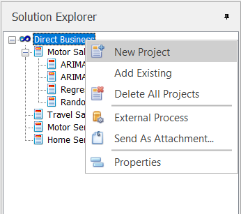
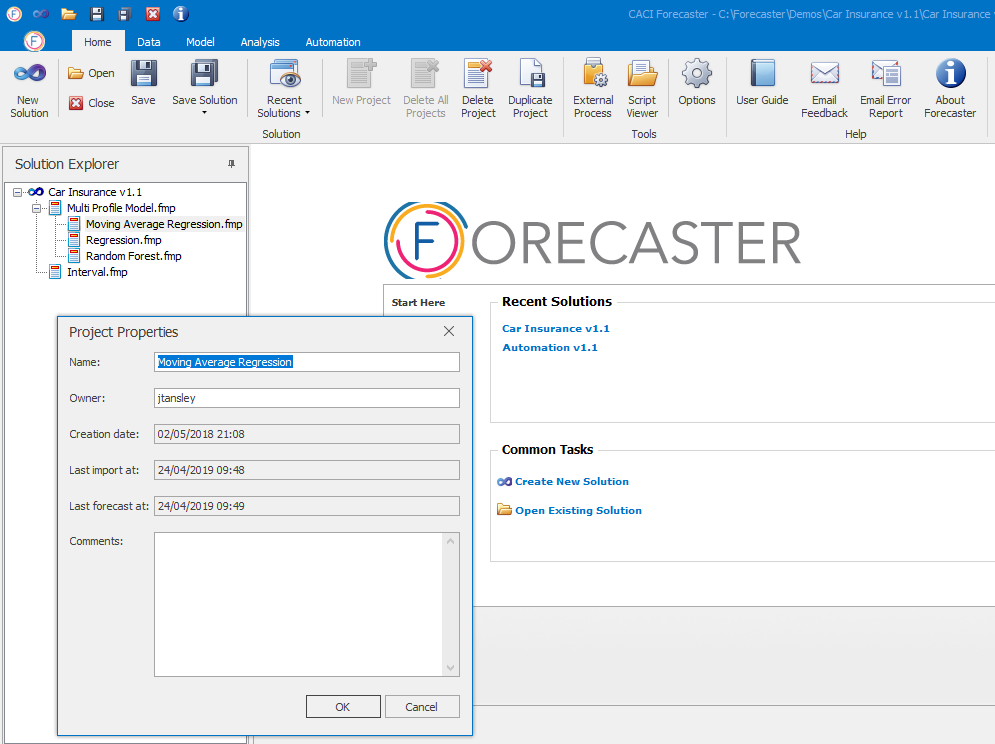
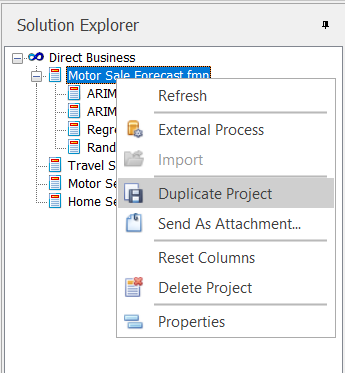
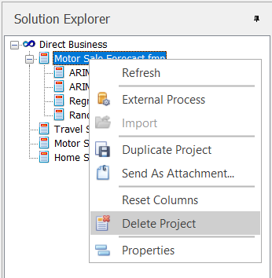

# Projects

A project holds data, a forecast model, and a set of forecasts, and is really at the core of Forecaster.  You can, for instance, create one project for each item you're forecasting, or create multiple projects with the same data in order to compare different forecasting models. This section explains how to manage your projects, both in the Solution Explorer, and using the ribbon in the *Home* tab. 

## New Project
To create a new project, click on the **New Project** button from the *Home* tab.  This creates a blank project, ready for reading in data and building forecasts.

Alternatively, you can  right-click on the solution in the Solution Explorer, then select **New Project** from the solution options:

## Project Properties and Renaming
To change the name of any project within a solution, right-click the project in the Solution Explorer and then select the *Properties* option.  The following dialog lets you change its name, as shown below.  You're also able to add comments to the project if needed.  Additional information on the creation date and time and creator of the project is also shown here.

## Duplicate Project
To create a copy of a project, right click on the relevant project in the Solution Explorer and then click on *Duplicate Project*.  

This creates an identical copy of the project, including data, model and settings. To show the connection between the two projects, in the Solution Explorer the copy is placed below the original project.

## Add Existing Project
Forecaster lets you take a project from one solution and insert it into another.  This might be useful when consolidating forecasts from a number of different sources to create the ‘operational’ versions after a period of investigation.

To add an existing project to the current solution, right-click on the solution name in the Solution Explorer and select *Add Existing* from the list of options.  This will then open up a navigation window where you can browse for the project you want to add.  If you try to import a project with a name that already exists in the current solution, Forecaster will ask whether you wish to overwrite the existing project.  You can then select no to cancel the process if needed.

## Delete Project
A project can be deleted via the Solution Explorer by right-clicking on the relevant project and choosing **Delete Project**. Forecaster will ask for confirmation that you really do want to do this.  Be aware that the project that will be deleted is the one that is currently active. 

# Where Next?
For more detail on the various components of Forecaster, you can jump to any of the sections describing the main Forecaster tabs, from the menu to the left. Alternatively, you can visit the *Use Cases* section below that for more information on a range of forecasting topics, from model selection to dealing with marketing delay curves.

