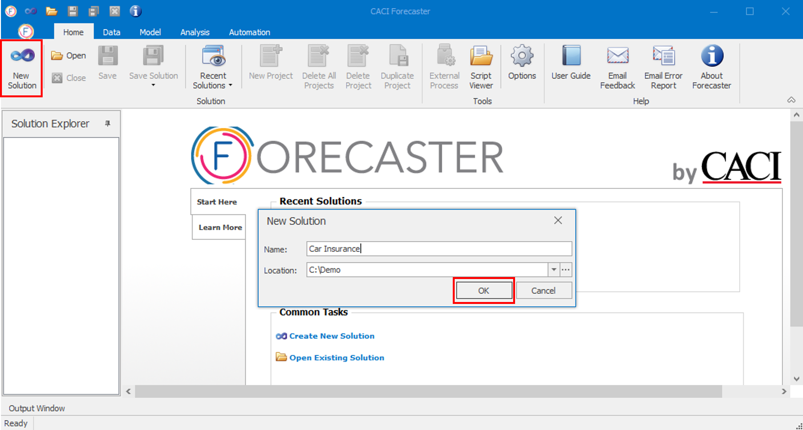
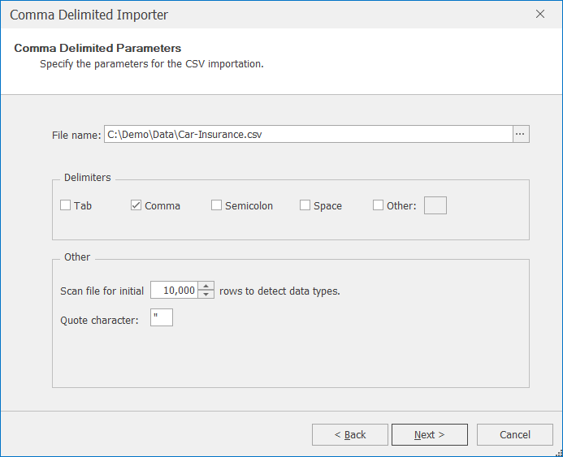
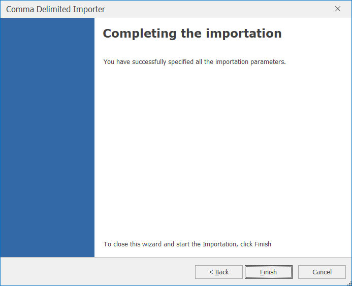
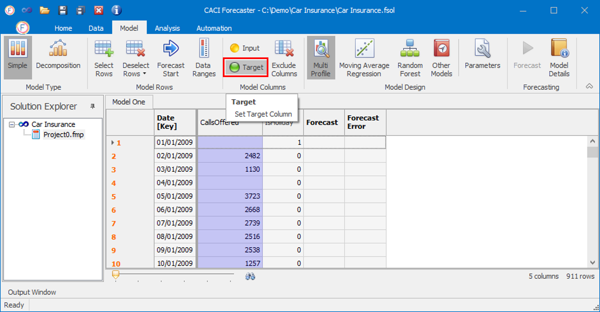
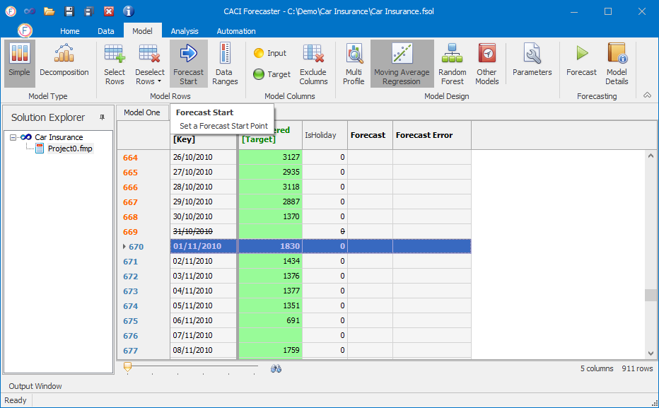
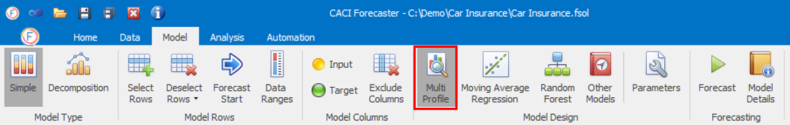
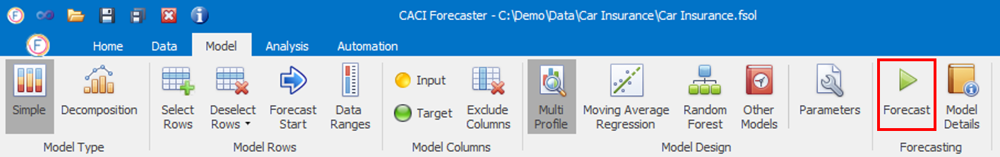
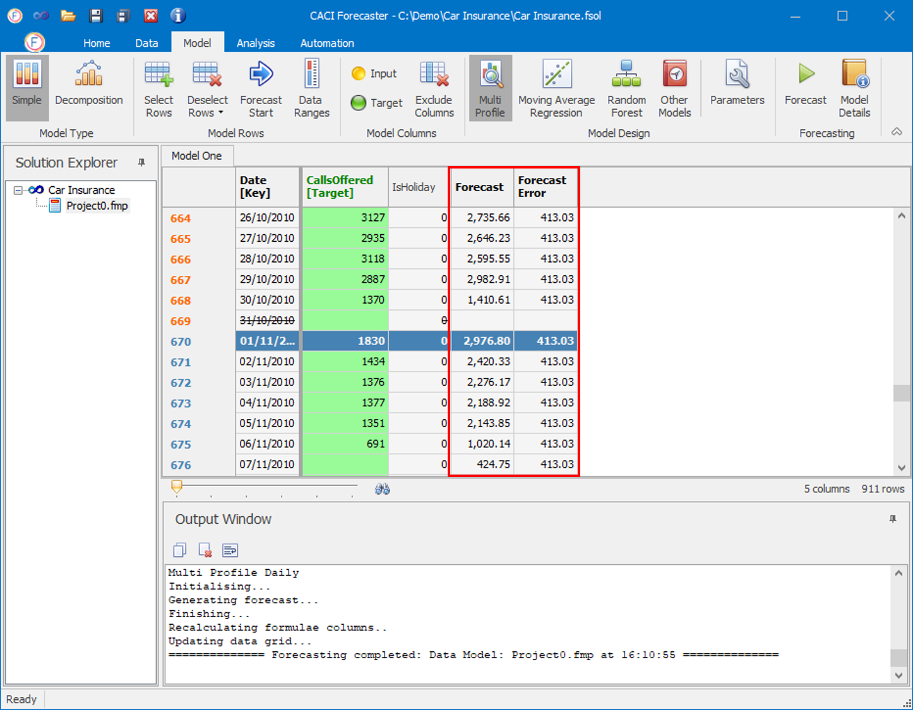
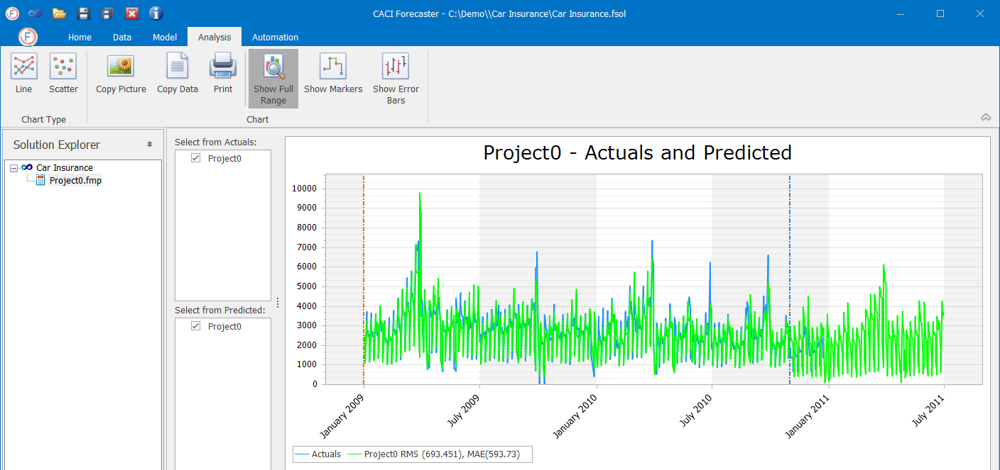

# Tutorial

CACI Forecaster is designed to let you get started very quickly with producing your own data-driven forecasts. This quick start tutorial covers the creation of a simple forecasting project. This example will walk you through creating forecasts of car insurance call volumes, based on historical data. This dataset holds only historical call volumes and public holidays, so you'll use a simple seasonality-based model.

## Before you Start

Make sure that you have the following:

1. CACI Forecaster installed,
2. A valid licence key (on first running Forecaster, an automatic key request will be generated - send this to us and we will get back to you with the relevant licence key)
3. The "Car Insurance" dataset; this can be downloaded from the link below.




You can jump to any of the sections of this page using the CONTENTS menu to the right.


## Create a new Solution
- Open CACI Forecaster.

- In Forecaster, under the *Home* tab, click **New** to create a new solution. A solution is a workspace that can hold any number of forecast projects.

<!-- TO DO: Update image -->

- Give this solution a name (e.g. "Car Insurance") in the *New Solution* window, and change the folder location if needed.

- Click **OK** to continue. This will now create an empty project, and move the focus to the *Data* tab.

## Import the Data
- In the *Data Importers* part of the ribbon, select the **Text** icon then click the **Import** button in order to import a text file.


Forecaster can also import from Excel files by using the **MS Excel** button rather than the **Text** button we've used here. In addition, more advanced importation is possible using the **Script** button. Out of the box, Forecaster is provided with a range of *Load With Harmonics* importation scripts. These append a range of useful additional data to any data import, including public holiday information for a range of countries. Additional customised importation scripts can also be created, in order to read, combine, or aggregate data from any range of files, data feeds, or databases.


- In the pop-up window, start a new importation by clicking **Next**, then browse for the data file *Car-Insurance.csv*, that you should already have downloaded.

- After checking that the comma delimiters option is ticked, continue to click **Next** to move through the series of windows until you see the following window:

This completes the data importation process, and you should see the call volume and public holiday information in the main Forecaster data grid.


Often, data re-importation is needed to update Forecaster with the very latest data. If the car insurance csv file were to be updated, clicking the 'Quick Re-Import' button would re-import from this updated file, bringing in the very latest data.


## Prepare the Data

- First of all, the *CallsOffered* column needs to be flagged up as the column to be forecasted. To to so, first select the *Model* tab, which brings up all the options for creating a forecast. Then select the *CallsOffered* column header and click on the **Target** round green button. *Target* means that this is the column that you want Forecaster to forecast for. (Columns can also be flagged up as *Input*, if they are to be used by Forecaster in order to increase forecast accuracy. For this simple model however, you'll not be needing any inputs.)

<!-- TO DO: Update image -->

- Forecaster works by first learning from past data to create a trained model which can then be used for forecasting. A wide range of different forecasting models are available, and the most useful ones for your specific data appear as the first 3 buttons on the *Model Design* part of the ribbon. For this daily car insurance data, the first model, **Multi Profile** should already be automatically selected. 
- Setting the forecast start point defines which rows Forecaster will used for training (learning or building) the model. All rows before the forecast start point are used for learning the predictive model. When used for generating a real live forecast, the forecast start point is typically set to the first row for which no target information is available. In this case, however, you can set this point a few weeks back from the last available data, so forecasts can be compared with the known actual values. Scroll down to row with date *01/11/2010* and select the row by clicking on the row header. Then click on the **Forecast Start** button - the forecast start point will be moved to this row, and the row will be highlighted in blue.

<!-- TO DO: Update image -->


Forecaster will use all data above the Forecast Start row (the training period) to train the model. The data below the Forecast Start row (the forecast period) will be used to validate the model's accuracy (this accuracy can be found on the output charts). In fact, forecasts will be generated for all rows in the dataset; looking back historically at areas where performance is lower can be really useful in improving model performance.


## Create the Forecasts

- Now the data has been set up, you can move to training the forecasting model and producing the forecasts. As this simple dataset has no business drivers, you can use a simple seasonal profile model. This multi profile model should already be automatically selected - check that the **Multi Profile** model is selected in the ribbon. 


If you'd like more information on the forecasting model being used, simply click the **Parameters** button. This will bring up a description of the model, as well as the list of training parameters. By default, these are set to sensible values that produce robust forecasts. However, there is a lot of flexibility to alter the parameters yourself if needed. For this exercise, leaving the default parameters unchanged produces a good forecast out of the box.


<!-- TO DO: Update image -->

- You can then simply click on the **Forecast** button to train the model and produce the forecasts!

<!-- TO DO: Update image -->

- The forecast and predicted error (expected model accuracy) will appear in the data table, as the last two columns. Details of the model are also displayed in the *Output window* at the bottom of the screen. Different models will show different information here. This *Multi Profile Daily* model shows the daily, weekly, and yearly profiles (where 100% is an average day), as well as the effects of public holidays (and the days before and after public holidays). Both long term and short term trends are also taken into account. These model details can also be found under the **Model Details** button to the right of the ribbon.

<!-- TO DO: Update image -->


The Forecast Error column holds expected forecast accuracy for each row. For this simple model, the same value is shown for all rows; this is just providing the average expected accuracy. More advanced models such as *ARIMA* provide different accuracy estimates for each row - this can be really useful for understanding where the model is confident in its predictions, and where forecasting is proving more difficult.


## Analyse the Results
- Click on the **Analysis** tab - a graph of the actual target value and forecast target is displayed with a range of performance metrics.

- Clicking on the **Show Full Range** button flips between showing the forecast period (the default), and the entire dataset.
- The mouse wheel controls zooming in and out (horizontal zooming)
- Data can be panned by clicking on the chart and dragging
- Zoom into a specific area by holding down the Shift key and dragging with the mouse
- Ctrl + mouse wheel zooms vertically only
- Shift + mouse wheel zooms both horizontally and vertically

 For more information on viewing forecasts, see the section on the [Analysis Tab](/reference/Analysis/Analysis.md).

<!-- This works: seems like you cannot get links like this to any file in a different folder -->
<!--  --> 
 <!-- Fail -->

 <!-- Fail -->

 <!-- Fail -->

 <!-- Fail -->

 <!-- Fail -->

 <!-- Fail -->
