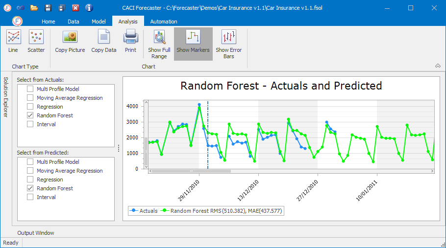
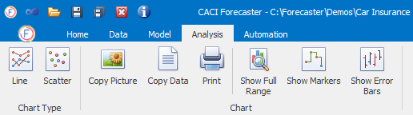
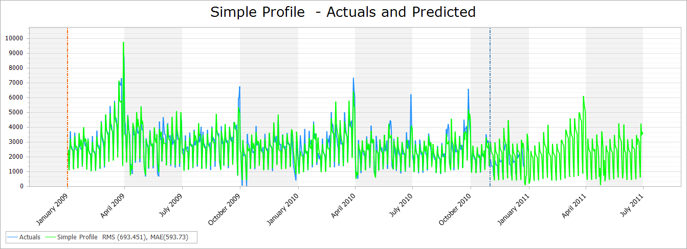
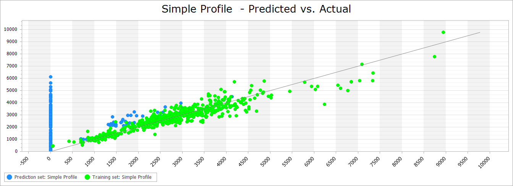

# Charts and Error Metrics
Forecasts charts are available under the **Analysis** tab, and are typically the best way of viewing and understanding forecast performance. Any number of forecasts can be plotted on the same chart in order to help comparison, and error metrics (accuracy estimates) are shown for all selected forecasts.


Although the *Solution Explorer* window is usually present on the left hand side of the Analysis tab, this has no effect on this tab, and can be minimised if needed to free up more screen space (by resizing, or by unpinning using the pin at the top right of the *Solution Explorer* pane).


These charts display both actual target values as well as the forecasts (where multiple forecasts from a range of projects can be shown). 

## The Analysis Tab Ribbon

The data can be viewed in two different chart types; a time series plot or a scatter plot, as show below. The **Line** and **Scatter** buttons on the left hand side of the main ribbon let you switch between these two chart types. In these charts, actuals are always shown in blue, whilst forecasts can be any one of a range of colours.

## The Analysis Tab Ribbon - Chart Section

* **Copy Picture** button: Copies the current chart to the Clipboard, so that it can be pasted into any other app such as Word or PowerPoint
* **Copy Data** button: This copies actuals and forecast data from all series in the chart, in a format that can be easily pasted into Excel
* **Print** button: Sends the chart to the default printer, if available
* **Show Full Range** button: When selected, zooms the chart out to view the full range of data. When deselected, shows purely the forecast range.
* **Show Markers** button: Shows markers for each data point (provided the date range is not too large, and there are too many data points to show)
* **Show Error Bars** button: Shows error bars for each data point (provided the date range is not too large, and there are too many data points to show). These error bars are the expected accuracy, output by the model in the *Forecast Error* column of the main data grid

## Selecting Actual and Predicted values

To the left of the main chart, the *Select from Actuals* and *Select from Predicted* boxes let you select the source projects of both the actuals data (shown in blue) and the forecast data. 

| Box                                                                                                                                                                                | Description                                                                                                                                                                                                   |
|--------------------------------------------------------------------------------------------------------------------------------------------------------------------------------------|---------------------------------------------------------------------------------------------------------------------------------------------------------------------------------------------------------------|
| Select from Actuals                                                                                                                                                                  | Lets you s the project which contains the actual target data.  Only one project can be selected. This selection defines the x axis, the training and forecast start lines (orange and blue respectively), and the Actual (target column) values.                                                                                              |
| Select from Predicted                                                                                                                                                                | Forecast values from all these projects will be shown on the chart. Any number of projects can be selected here. As the x axis of the chart is defined by the Actuals selection, data must cover a similar time range (and the same granularity, such as daily or interval). |

## Navigating the charts

- Clicking on the **Show Full Range** button flips between showing the forecast period (the default), and the entire dataset.
- The mouse wheel controls zooming in and out (horizontal zooming)
- Data can be panned by clicking on the chart and dragging
- Zoom into a specific area by holding down the Shift key and dragging with the mouse
- Ctrl + mouse wheel zooms vertically only
- Shift + mouse wheel zooms both horizontally and vertically

For the Time Series Chart the legend contains, for each forecast project, error metrics that measure the performance of each forecast when compared to the actuals.  The two error metrics are Root Mean Square (RMS) and Mean Absolute Error (MAE), and are calculated for the forecast range only.

## Error metrics

Error metrics for each Predicted series are shown in the chart legend below the plot. Error metrics show the accuracy of a forecast by summarising the different between actual values and a model's forecasts. Small values show that the error is small, meaning that forecasts and actuals are close. The error metrics shown on these charts are calculated over the **forecast range only** (on the chart, this is generally all the rows after the dotted blue line for which both actual and forecast values are available).

For the 2 error metrics described below (RMS, MAE), errors are measured in the same units as the forecasts, so an error of 30 on a daily call volume forecast means that the difference between actuals and forecasts is around 30 calls.

| Error Metric                                                                                        | Formula | Description                                                                   |
|-----------------------------------------------------------------------------------------------------|:---:|-------------------------------------------------------------------------------|
| **Root Mean Square Error (RMS)**                                                                              |   $$\sqrt{\frac{1}{n}  \sum_{i=1}^n(f_i-\alpha_i)^2}$$      | The square root of the average of the squared errors. This is similar to a 1 sigma credible interval, so we'd expect around 68% of actuals to lie within this distance of the forecasts (and 95% of actuals to be within twice this range)
| **Mean Absolute Error (MAE)**                                                                          |   $$ \frac{1}{n} \sum_{i=1}^n \left\lvert{f_i-\alpha_i}\right\rvert$$      | The average of the absolute error (i.e. the error with  the +/- sign removed) |

<!-- This bit doesn't display correctly in the VS Code preview, but is OK live -->
Where $$n:=$$ number of observations in the forecast range,  $$f_i:=$$ forecast value for observation $$i$$, $$\alpha_i:=$$ actual value for observation $$i$$.

