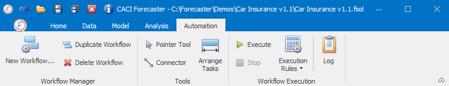

# Automation

The last item on the main ribbon is the Automation tab. This tab lets you automate the whole forecasting process by creating **workflows**. Workflows can be used to automate the running of a wide range of tasks, such as creating a project, importing or re-importing data, setting up models, creating the forecasts and exporting the results.

 Workflows are easy to run, and minimise the potential for error, particularly when dealing with large numbers of forecasts. Multiple projects can be created at the same time (using bespoke importers only - this is not currently possible with the default Load With Harmonics importers).

To learn how to create and set up Workflows, see here:


To learn how to Run Workflows, see here:

<!--
To find information about Creating Projects with Workflows, see here:

-->