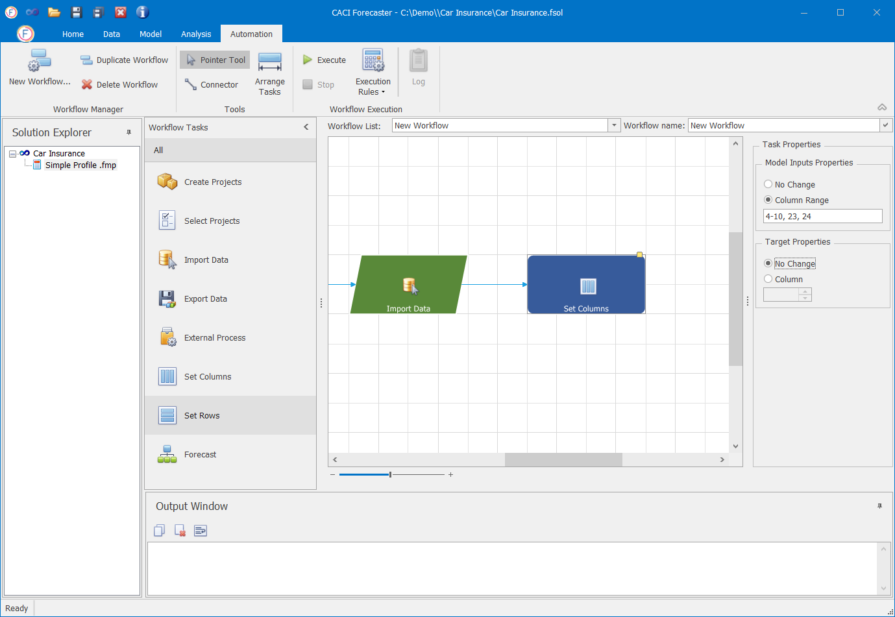

# Workflows

Workflows are used to automate common tasks such as creating a project, re-importation, model re-training, and data export. Workflows are far faster to run than doing everything manually, and minimise the potential for error. 


Although the *Solution Explorer* window is usually present on the left hand side of the Automation tab, this has no effect on this tab, and can be minimised if needed to free up more screen space (by resizing, or by unpinning using the pin at the top right of the *Solution Explorer* pane).


## Workflow Manager Ribbon Section
This section to the left of the main *Automation* ribbon lets you perform basic workflow management tasks, such as creating and deleting workflows.

### Creating a Workflow

To create a new workflow, click on the **New Workflow** button under the Automation tab, as in the image below.

The title of a Workflow can be changed from the *Workflow name* field.

Once the Workflow has been initialized, you can start building up a sequence of Workflow Tasks. 

### Duplicate workflow

To create a copy of a workflow click on the **Duplicate Workflow** button as shown below.

### Delete Workflow

To delete a workflow click on the **Delete Workflow** button as shown below.

## Tools Ribbon Section

This ribbon section lets you layout and edit workflows within the main workflow pane.

- **Pointer Tool**: When selected (the default), this lets you select and move tasks within the workflow.
- **Connector**: When selected, this lets you draw connections between workflow tasks. (This isn't needed very often, as when adding a new task to a workflow is it automatically connected to the last task in the workflow.) 
- **Arrange Tasks**: Clicking this button re-arranges workflow tasks in a tidy manner

Connections can be removed at any time by simply selecting the connection and pressing `Delete`.

## Workflow Execution Ribbon Section

This ribbon section lets you run, control, and monitor workflows. See the [Running Workflows](Running-workflows.md) section for more details.
 

## Workflow Tasks

A Workflow can contain any number  of Workflow Tasks. A Task is a specific action such as importing data, or setting a forecast start point. Tasks can be chained together within a workflow to be run one after the other. Clicking on any task in the main pane brings up its details in the *Task Properties* pane to the right of the screen.

The available Workflow Tasks are shown to the left of the screen:

 

### Adding a Workflow Task

Tasks can be added to the Workflow by simply dragging and dropping them from the Workflow Tasks pane to the main workflow pane. When a Task is added to the pane, it is automatically added at the end of the workflow and connected with the last Workflow Task.

### Deleting a Workflow Task
To delete a Workflow Task select the task within the workflow and press the `delete` key.

### Workflow Task: Select Projects

To build a new workflow, you can either start from the Create Projects or Select Projects tasks. The Create Projects is used when you have a custom importation process created by CACI. Otherwise, the Select Projects task should be selected.

The Select Projects option is used in order to re-use one or multiple existing Project(s) of a Solution. To do so, simply drag the Select Projects task into the main workflow pane.

When the Select Projects task is selected, a list of the Solution's Projects appear in the right-hand pane. You can select one or multiple Projects to include in the workflow.

### Workflow Task: Create Projects

As already mentioned, to build a new workflow you can either start from the Create Projects or Select Projects tasks. If you have a custom importation process built by CACI then you have to start from the Create Projects task. The Projects will be created based on the defined categories in the custom importation process.

### Workflow Task: Import Data

The Import Data task is used to import data using the existing Importer. NB: This workflow task will perform an *Update Re-import* only, the *Start New* and *Clean Re-import* options to the right should be ignored.

### Workflow Task: Set Columns

The Set Columns task is used to specify the target column of the model as well as any model inputs. Columns are specified by their position in the grid, with column 1 being the first (key) column. (Specifying columns in this way is slightly more cumbersome, but allows workflows to operate across a range of different projects). When using multiple columns, column indices should be separated by commas. Column ranges can also be specified (e.g. 4-10). In the example below, the range of columns selected is specified as *4-10, 23, 24*. When the *No Change* option is selected, the project's existing configuration is used with no change.

### Workflow Task: Set Rows

The Set Rows task is used to specify the starting point and the length of the forecasting period, using the *Forecast Start* and *Forecast Length* sections of the Task Properties

#### Forecast Start
 As shown in the screenshot above, this can be set in 4 different ways, in the *Forecast Start* section:
 1. **After Last Target Value**: This sets the forecast start point to the first row after the that containing the last valid target value. This is often the best and safest option to use, particularly when running across multiple projects that may hold different data
 2. **Move by rows**: This lets you step forward (or move back) the forecast start point by a given number of rows. This can be useful for instance, if you'd like to step all forecast start points by 7 days (7 rows). This option is generally not recommended, as it makes it harder to track exactly where the forecast starts. (For example, if a workflow were stopped half way through, then restarted, this would lead to different forecast start point changes across different projects.)
 3. **Date / Interval Key**: Lets you specify the key for the forecast start point, for date or interval based projects
 4. **Integer Key**: Let you set the key for the forecast start point, for non time (key index based) projects

#### Forecast Length
 As shown in the screenshot above, this can be set in two different ways, in the *Forecast Length* section:
1. **Set Forecast Length to the last Row**: This will set the forecast period to run all the way to the end of the dataset (the default)
2. **Set Forecast Length to**: Lets you directly set the length of the forecast period (in rows). 


Forecasts will generally be produced for all rows, not just those in the Forecast Range. The Forecast Range , however, determines the range used for calculating the error (forecast accuracy) metrics shown in the series legends in the Analysis tab.


### Workflow Task: Forecast

This workflow task lets you select the forecast model to be used for the forecast. You can either re-use the model selected within the project (using *Reuse Existing*) or setup a new one (using *Setup New**, and selecting the model from the dropdown). Clicking on the "..." button next to the right of the model name brings up the Model Parameters screen, where you can view and change the model's parameters.

### Workflow Task: Export Data

The Export Data task is used to export the results of a workflow using the standard Data Exporter (to be found in the ribbon on the *Data* tab). From the properties pane you can run the exporter unchanged (using *Reuse existing*), or setup a new exporter.
When setting up a new exporter, the target directory can be selected from the *Target directory* box. Outputs will be saved in comma separated csv format, using the project name as the file name. The Target Directory can be a network folder so the results can be directly shared with others.


For more flexible exportation, including the ability to select data ranges and export as Excel workbooks, you can instead use the *Export Data* External Process (using an External Process workflow node rather than this *Export Data* node).


### Workflow Task: External Process

The External Process Workflow Task lest you set up any available external process, including custom business specific data exports. From the properties pane you can run the external process unchanged (using *Reuse existing*), or setup a new process.
*Setup new* lets you set up a new external process. Clicking on the `...` to the right of this drop-down lets you select the external process and set its parameters.

