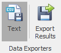
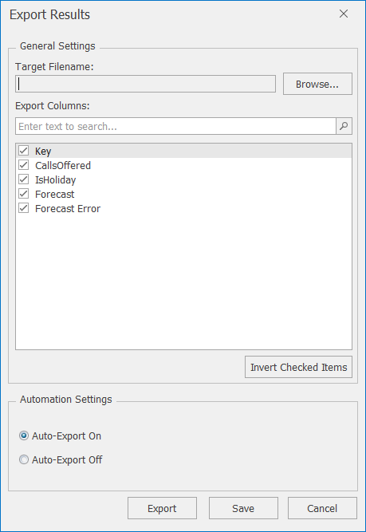

# Data Exporters

The *Data Exporters* section of the *Data* tab ribbon lets you set up and control Forecaster's inbuilt data exportation. This exports data to csv format. It can be set up to export any selection of columns you like, and can also be configured to automatically export each time a new forecast is created. 


For more flexible exportation, which also gives the option to select just the forecast range, as well having the option to export to Excel, another alternative is the *Export Data* External Process described [here]().


To export the data, first click on **Text** and then **Export Results** - the dialog shown below should appear:

The following tables describe the various options available in the Export Results screen.

## Export Results Settings
| Setting             | Description                                                                                                                                                                                                      |
|---------------------|------------------------------------------------------------------------------------------------------------------------------------------------------------------------------------------------------------------|
| Target Filename     | The path and file name of the csv file where the data will be exported to.  (This csv file can later on be opened in Excel as needed.)                                                                            |
| Export Columns      | Lets you select the set of columns to export                                                                                                                                       |
| Automation Settings | By selecting **Auto-Export On**, the latest data will be exported to the specified file each time you generate a forecast.  If you only want to export the data once, select **Auto-Export Off**, then the **Export** button |

## Export Results Buttons

| Option | Description                                                                                                                           |
|--------|---------------------------------------------------------------------------------------------------------------------------------------|
| Export | Exports the data and saves the current settings                                                                         |
| Save   | Saves the current settings.  If **Auto-Export On** is selected, the data will be exported next time you generate a forecast |
| Cancel | Closes the Export Results window without saving changes                                                                               |
