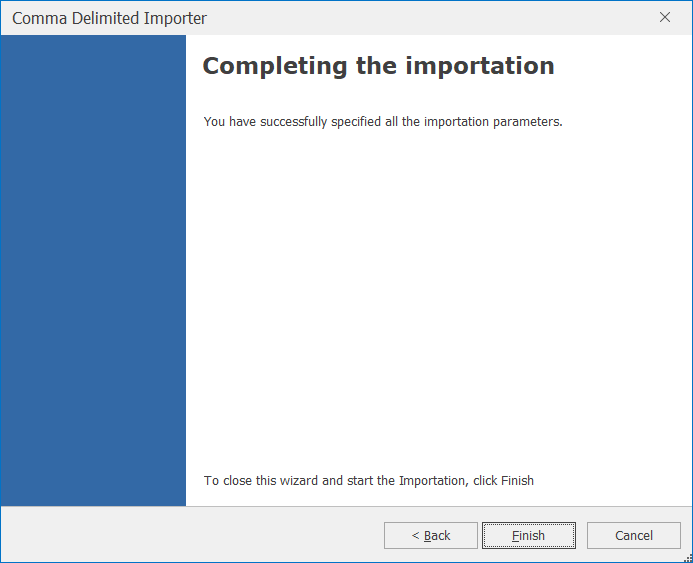
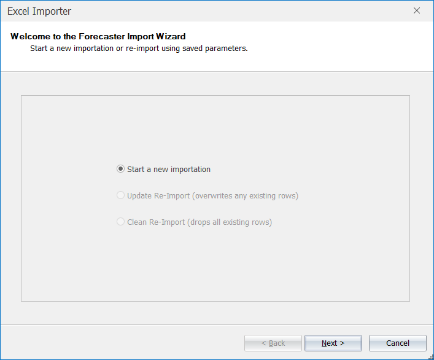

# Data Importers

Forecaster is designed to read in and work with time series data. This is data that has an explicit (usually time based) ordering. This order is defined by a key column, typically a date or date-time column. 


Unordered data can also be read in to Forecaster - for this kind of data Forecaster can automatically create a dummy key column. Models such as Regression or Random Forests that are not limited to time series forecasting can then be applied. Random Forests can also be used to build propensity models, for example for forecasting churn rates or marketing response rates.


Data can be imported via three different importers; *Text*, *Excel*, and *Script*. The Text and Excel importers read in data pretty much as is, with very little additional processing. The *Script* importers are the most useful and commonly used importers, and can be used to add in additional public holiday and seasonal information when reading in data.

1. **Text:**
Used to import a text file, for example .csv. This reads in the data as is, with very little additional processing.

2. **MS Excel:**
Used to import an Excel file. This reads in the data as is, with very little additional processing.

3. **Script:** 
This the most commonly used way of reading data into Forecaster. There are two main types of script: 

    - Load with Harmonics scripts: These let you import from flat files such as csv files, while appending useful information on public holidays and harmonics (to help model seasonality). A range of scripts is available in order to load interval, daily, weekly, or monthly data.
    - Bespoke importation scripts: These can be created by CACI (or by users with R knowledge) in order to import specific business data. For instance, these could be set up to read directly from a database, as well as merging in data from reports and local flat files. To find out more, please contact CACI directly.


For details of all Script Importers, see the full list here:  [**Importers**](Importers/Importers.md). 


## Importation Modes
Whichever type of importer you use (Text, Excel, or Script), you can import data in 3 different ways:
* **New importation**: Used when loading data into a project for the first time, or if you want to drop the existing data in a project and start afresh. If the project already has data, then all existing data and models will be dropped, and the new data will be read in to a clean project. This is the only option for a brand new project.
* **Update Re-Import**: This option will keep all existing data, while adding in any new rows from the new dataset. If the new dataset has any rows that already exist in the project, this new data will overwrite the existing project data. All row and column selections, as well as any forecast models, are left unchanged. This is the default option if a project already holds some data.
* **Clean Re-Import**: This option will drop all existing project data, and simply read in the new dataset. All row information, such as deselected rows or the forecast start point will be dropped. However, this option differs from the *New importation* option in that all column information and forecast models are preserved. This option can be really useful for providing a complete refresh of the project data, without losing any modelling information such as model inputs, or the forecast model and its parameters.

## Quick Re-import

When new data becomes available, it is generally worth re-importing this data, to update both the forecasting model and the resulting forecasts by taking into account the very latest data. The quickest way of re-importing data is to use the **Quick Re-import** button; this will re-import from the original data source, bringing in any new changes that may be present. 

If you want more control over the re-importation process (e.g. to change the number of harmonics), you can instead click the **Import** button, which will take you through the importation wizard you used when you first set up the project. Typically you'll want to leave most of the parameters unchanged, but this does give you the flexibility to alter any aspect of the importation.

## The Importers
Once you've selected a particular importer (Text, Excel, or Script), click on Import to open the importation wizard.

The following sections will describe how to import data into a new project, using the three different importers. You can cancel the import at any time by pressing the **Cancel** button. If at any point you need to change some wizard settings press the **Back** button to go back a step through the importation wizard process.

The following sections go into more detail on the 3 types of importer: Text, Excel, and Script.

## Text Importer
The Text Importer is used to read in from a text file, for example in comma separated .csv format. This importer reads in the data as is, with very little additional processing. We would generally recommend using a *Load With Harmonics* Script Importer instead, which will give you far more flexibility.

 Once you've selected *Text*, then clicked **Import** on the *Data Importers* section of the ribbon, the Comma Delimited Importer will open.  If this is a brand new importation, the only option available is to start a new importation. 

<!-- TO DO: Details on various types of importation -->

After clicking on Next, the next dialog lets you browse for the file to be read in. The default delimiter is a comma, but other delimiters can also be selected (as shown in the image below).  
Forecaster will automatically detect the datatype for each column. By default, it scans the first 10,000 rows, but this can be changed if needed. Scanning fewer rows would make importation slightly quicker, while scanning more rows would be more robust, in case for instance a different data  type turns up later in the file. (These automatically inferred datatypes can be altered manually, either later on in the importation importation, or within the data grid on the *Data* tab after the data has been read in). 

The *Quote character* box lets you select the character to be used to identify text.

### Column Configuration Dialog

Clicking on Next brings you to the Column Configuration dialog where you can see a preview of the data, with the column identified as the key highlighted in blue.  This text importer assumes that the first column contains the key (usually a date or date-time).  However, if this first column contains duplicate values, an auto-generated key column will be created instead.  If you'd prefer to use an auto-generated key column instead of the default first column, tick the *Auto-Generate Key Column* option.
 

By clicking the *Advanced* view (as shown below), you can adjust the data type of each column if needed.
 

| Data Type | Description                                                                 | Additional information                                                                                                                                                                                     |
|-----------|-----------------------------------------------------------------------------|----------------------------------------------------------------------------------------------------------------------------------------------------------------------------------------------------------------------------------------------------------------------------------------------------------------------------------------------------------------------------------------------------------------------------------------------------------------------------------------------------------------------------------------------------------------------------------------------------------------------------------------------------------------------------------------------------|
| Double    | A real or continuous number, i.e. a number with decimal places (e.g. 1.234) | - *FormatDecimals*: Set the number of decimal places  - *FormatThousands*: Use a comma to separate thousands                                                                                                                                                                                                                                                     |
| Integer   | A whole number, such as 1, 2, 3, or 4                                          |        None                                                                                                                                                                                                                                                                                                 |
| DateTime  | Either dates or datetimes                                    | - *FormatDateTime*: Define whether the variable is a date, time or date and time    - *IncrementType*: This can be one of Daily, Weekly, Monthly, or Minute, depending on the data   - *IncrementStep*: This sets the frequency of the *IncrementType* value.  For example, for daily data, *IncrementType* should be to be *Daily* and the *IncrementStep* should be 1. If the data is recorded once every two weeks, then the *IncrementType* should be *Weekly* and *IncrementStep* set to 2 
| String    | For text columns     |      None     |

Clicking Next followed by Finish completes the importation.

## Excel Importer
The Excel Importer is used to read in from Excel files. The formats .xls, .xlsx, .xlsm, and .xlsb are all supported. This functionality does require the presence of Excel on the host machine. All versions of Excel are supported **apart from Excel 2013.** This importer reads in the data as is, with very little additional processing. We would generally recommend saving the Excel document as csv, then reading in to Forecaster using a *Load With Harmonics* Script Importer, which will give you far more flexibility.

Once you've selected *Excel*, then clicked **Import** on the *Data Importers* section of the ribbon, the Excel Importer will open.  If this is a brand new importation, the only option available is to start a new importation. 
 
 

After clicking on Next, the next dialog lets you browse for the Excel file.  By leaving the Suggest Data Types box ticked, Forecaster will automatically define data types for each column.  
 

The following screen will ask you to select the relevant worksheet within the Excel file.
 
 <!-- TO DO: Sort out Excel importation bug (TSF-503), add image -->
Excel Import Wizard - Sheet Selection

Clicking on Next will bring you to the Column Configuration screen.  The importation will then complete by clicking on Next followed by Finish.

## Script Importer
Once you've selected *Script*, then clicked **Import** on the *Data Importers* section of the ribbon, the Script Importer will open.  
 

After clicking **Next**, the next dialog lets you select a particular Script Importer from a drop-down, and view and alter any parameters if needed. 

The standard way of reading data into Forecaster is using one of the *Load With Harmonics* script importers. These append a range of useful additional data to any data import, including public holiday information for a range of countries (and some regions). Simply choose the importer that matches the data you're reading in, whether that's interval level, daily, weekly, or monthly. 


Additional customised importation scripts can also be created, in order to read, combine, or aggregate data from any range of files, data feeds, or databases. These can be created by CACI (or by users with R knowledge) in order to import specific business data. For instance, these could be set up to read directly from a database, as well as merging in data from reports and local flat files. To find out more, please contact CACI directly.


## Importing data using the *Load With Harmonics - Daily* Script Importer

This section covers how to use a typical Script Importer, using the *Load With Harmonics - Daily* importer as an example. The equivalent weekly and monthly importers (*Load With Harmonics - Weekly* and *Load With Harmonics - Monthly*) are identical, apart from their lack of daily harmonics (and lack of weekly harmonics for *Load With Harmonics - Monthly*).


For details of all Script Importers, see the full list here:  [**Importers**](Importers/Importers.md). 


Once *Load With Harmonics - Daily* is selected from the drop-down at the top of the Script Selector dialog, you should see the parameters as shown below. You'll need to browse for the csv file to be read in, but apart from that you can very often run with the default parameters without needing to change anything else. The parameters and their effects are described here, but these details can also be found by hovering over the blue **(i)** icon in front of each parameter name.

 

### *Load With Harmonics - Daily* parameters

- **csv file to read in**: Select the csv file to read in. Comma separated files only are accepted.
- **Name of the date column**: If left blank, the first column in the file will be used
- **Number of weekly harmonics**: The number of weekly harmonics columns to create. When added as inputs to forecast models such as regression, they help the models handle within-week seasonality. The default is 3. Increasing this number will have very little effect. Decreasing this number will lead to smoother within-week profiles. (This parameter is not present in *Load With Harmonics - Weekly* or *Load With Harmonics - Monthly*.)
- **Number of monthly harmonics**: The number of monthly harmonics columns to create. When added as inputs to forecast models such as regression, they help the models handle within-month seasonality. The default is 4. Increasing this number will let a model handle spikier within-month profiles, while decreasing it will lead to smoother within-month profiles. (This parameter is not present in *Load With Harmonics - Monthly*.)
- **Number of yearly harmonics**: The number of yearly harmonics columns to create. When added as inputs to forecast models
such as regression, they help the models handle within-year seasonality. The default is 5.
Increasing this number will let a model handle spikier within-year profiles,
while decreasing it will lead to smoother within-year profiles.
- **Country and region**: Public holidays will be appended for any country selected here. 
Within each country, holidays for any particular region can be selected (selecting a region will also bring back national level holidays). If 'National' is selected, only national holidays will be included. If 'All' is selected, all national and regional holidays will be included. The current list of countries covers:
    
    * Belgium: National holidays only
    * France: National and some regional holidays
    * Germany: National and regional holidays
    * Greece: National holidays only
    * Italy: National and regional holidays
    * Netherlands: National holidays only
    * Poland: National holidays only
    * Portugal: National holidays only
    * Ireland: National holidays only
    * Spain: National and regional holidays
    * UK: National and regional holidays
    * US: National and regional holidays
    
- **Project forecasts to read in**: This holds a drop-down list of all projects in the solution. Multiple projects can be selected, and forecasts from these projects will be read in as well. 
- **Project forecasts: use actuals from training period**: Applies to forecasts read in from other projects. If ticked, actual values will be used up to the first forecast row, and forecast values after that. If unticked, forecasts only are read in for all available rows.
- **UK date format**: If checked (the default), UK date format is assumed for the key column. If unchecked, US date format is assumed instead.
- **Number of working days in the week**: Must be 5, 6, or 7. If 5, Monday to Friday are flagged as working days, if 6, Saturday is included as well, and if 7, all days are flagged as working days.

After clicking on Next, the following window shows the progress of the importation, as seen below.

Clicking on Next will bring you to the Column Configuration screen which has already been described higher up this page in the *Text Importer* [Column Configuration Dialog](#Column-Configuration-Dialog) section. You can complete the importation by clicking on Next followed by Finish.

This Load With Harmonics script importer will have read in the original csv data, and augmented that dataset with a range of useful information, from public holidays, to workdays and harmonics (to help model seasonality in regression type models).

<!--

The import process will then make use of the key column.  It is assumed that the import file will be the same as the original file, that its format is the same, the column positions of each variable are the same, and that their types remain constant.  The key variable is used to overwrite any values in the data grid with values from the import data.  Therefore if you have historical data that has been changed in Forecaster but not reflected in the source data, the modified values will be overwritten with the original values. 
 
If Update Re-Import is selected, then any rows with key values not visible in the new source data will remain unchanged.  For example, if your import data file only contains data from March 2011, yet the data grid in Forecaster contains data from January 2011, then the updated data grid will contain data from January 2011, with the values from March 2011 taken from the new import file.  To prevent this from happening (and therefore only include the new source data in the data grid), select Clean Re-Import instead.

## Re-importing data

When new data becomes available, it is generally worth re-importing this data, to update both the forecasting model and the resulting forecasts by taking into account the very latest data. The quickest way of re-importing data is to use the **Quick Re-import** button; this will re-import from the original data source, bringing in any new changes that may be present. 

If you want more control over the re-importation process (e.g. to change the number of harmonics), you can instead click the **Import** button, which will take you through the importation wizard you used when you first set up the project. Typically you'll want to leave most of the parameters unchanged, but this does give you the flexibility to alter any aspect of the importation.
-->