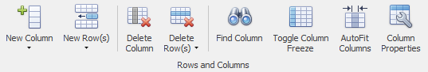
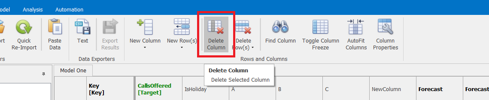
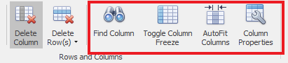
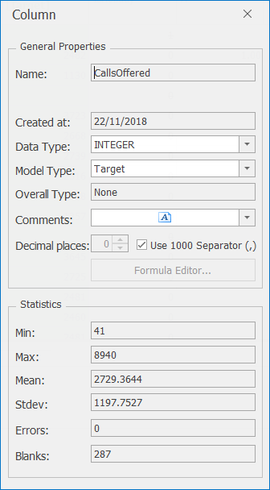

# Rows and Columns

The *Rows and Columns* section on the Data tab's ribbon is where you find the functionality for deriving new fields from the imported data, creating or deleting columns, as well as providing summary statistics for each column.

## New Column
Clicking the **New Column** button lets you create a new column in two different ways: either adding a pure data column which can be manually edited, or using a formula.

1. **Add Column**: This option lets you create a pure data column that can be manually edited. This can be useful for instance when wanting to add manual overlays to forecasts. A column added in this way will initially be all blank, and any values can be added in manually as needed. This column could then be selected when building a forecast model as one of the overlay columns, to overwrite or tweak the Forecaster's initial data-drive forecast. The dialog that pops up here lets you set the name of the new column, and also select the data type. The data type can be one of:

    * DOUBLE: To store real or continuous number, i.e. a number with decimal places (e.g. 1.234). This is the default, and is usually the best choice for numeric data
    * INTEGER: A whole number, such as 1, 2, 3, or 4
    * DATE: For dates
    * TEXT: For any other non-numeric or date values

2. **Add Formula**: This option lets you define a column that is defined by a formula, usually feeding off other columns. This can be really useful for instance in modelling marketing time delays, where outbound activity may well affect demand a few days after the known drop date.

## New Row(s)
 The **New Row(s)** ribbon button lets you insert rows either at the start or end of the dataset. The *Enter Value* dialog lets you select the number of rows you'd like added to the start or the end of the dataset. 
 

 As this **New Row(s)** option simply adds blank rows, its usefulness can be quite limited in most cases. A better way of extending datasets is usually by reading in additional rows from the raw data. Using one of the standard *Load With Harmonics* importers, any rows added to the start or end of the raw csv file will be read into Forecaster. This then has the advantage that all the ancillary public holiday and seasonal columns will also be fully populated.


## Delete Column

To delete any column from the data grid, select the column with a left mouse click and then press the **Delete Column** button.  The column will only be removed if it has no dependencies (i.e. other derived columns refer this column in their calculations).

### Example
Following on from the previous example, if you wanted to delete the derived formula column, you'd first need to select the NewColumn and click on the **Delete Column** button as shown below.

## Delete Row(s)
The **Delete Row(s)** ribbon button lets you delete a number of rows from either the start or the end of the dataset. The *Enter Value* dialog lets you select the number of rows you'd like to remove from the start or the end of the dataset. 


 Rows that are part of the training or forecast ranges cannot be deleted. To do so, first change the training or forecast ranges so that the rows to be deleted are no longer highlighted (the row index is not bold orange for training range, or bold blue for forecast range).


## Find Column
The **Find Column** button lets you search for a column by name. You can pick up the same functionality from the binoculars icon underneath the data grid. You can search using partial names, and the dialog will return a list of the columns that start with those characters. NB: You must type in the first characters at start of the column name - this does not try and match within the column names. Clicking the **Go To** button jumps to the requested column.

## Toggle Column Freeze
The **Toggle Column Freeze** button lets you move columns to the far left of the data grid. This can be handy for moving together columns that you'd like to compare side by side. NB: This re-ordering is not saved within the project, and column order will be reset if you move away to another project.

## AutoFit Columns
The **AutoFit Columns** button resizes columns so that the column name is fully visible. This can be of great help with long column names that might not be initially all visible. NB: This re-sizing of columns is based purely on the length of the column names, and doesn't necessarily guarantee that all the data within the column will be completely visible.

## Column Properties

To see full column properties and summary statistics for a column, select the column, then click the **Column Properties** button to the right of the *Data* tab ribbon. This will bring up the following dialog, which shows you all column information, some of which can be edited.
  

From this dialog, you can:
-	Change a column's data type, by selecting a new type from the *Data Type* drop down list.  Forecaster will try to convert the data to the new format you've just specified. (It is worth noting that in some cases there may well be a loss of detail.  For instance when going from double to integer you'll lose the fractional part (for example 3.5 would be replaced by 3).)
-	Change the model column type, i.e. whether a field is an input or target.  For more details on this, see the [Model Columns](../Forecasting/Model-Columns.md) section.
-	Add comments about the column

As well as providing high level information on the column, Forecaster also calculates the following summary statistics (for numeric columns):

| Statistic | Description                                         |
|-----------|-----------------------------------------------------|
| Min       | The minimum value recorded in the column            |
| Max       | The maximum value recorded in the column            |
| Mean      | The average value for non-missing values            |
| Stdev     | The standard deviation for non-missing values       |
| Errors    | The number of error values recorded in the column   |
| Missing   | The number of missing values recorded in the column |


These quick statistics will also be displayed in a pop-up if you hover the mouse pointer over any column name in the data grid.


Clicking on the **Formula Editor** button in this dialog will bring up the Formula Editor, if this is a derived column.

For detailed information on the Formula Editor, see the next section:

