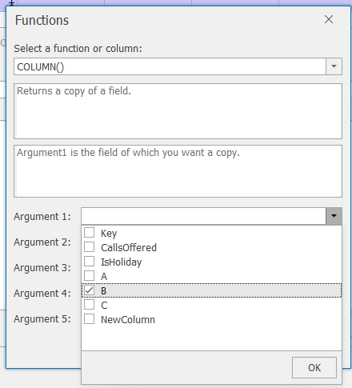
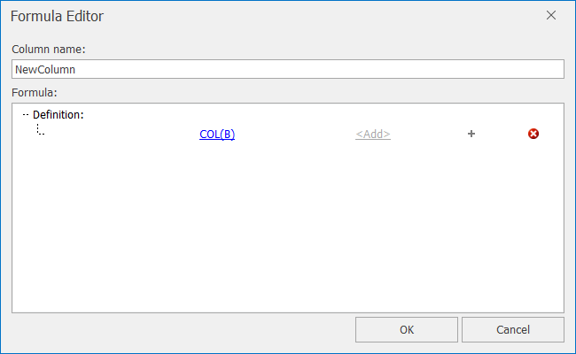
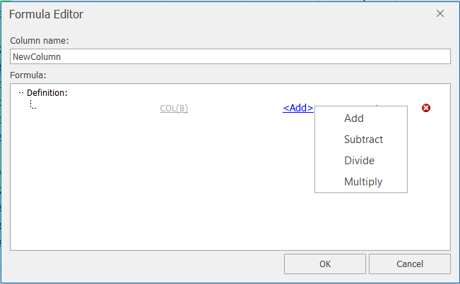
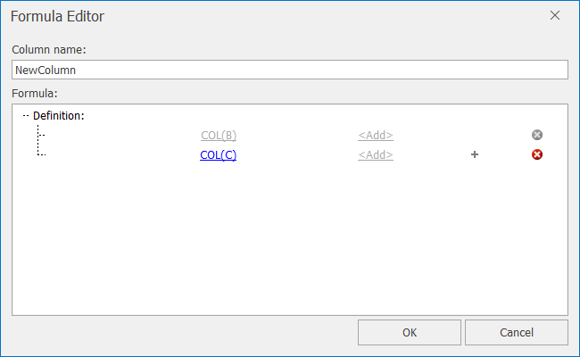
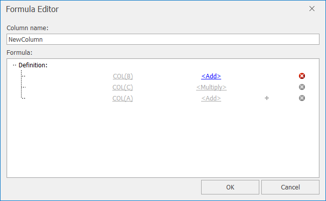

# Data Columns

The Columns group on the Data tab is where you find the functionality for deriving new fields from the imported data, deleting columns and providing summary statistics for each column.

## Column Properties
To see column properties and summary statistics for each column, you can move the mouse pointer over to the column name of interest in the data grid and wait for the tool-tip to be displayed.  Alternatively, select the column of interest and click the **Column Properties** button in the *Data – Data Columns* ribbon.  
 
 

This will then display a dialog in which it is possible to:
-	Change its data type, by selecting a new type from the data type drop down list.  Forecaster will try to convert the data to the new format you've just specified. However, it's worth noting that in some cases there may well be a loss of detail.  For instance when going from double to integer you'll lose the fractional part (for example 3.5 would be replaced by 3).

-	Change the model column type, i.e. whether a field is an input or target.  For more details on this, see the Forecasting\Model Columns section.
-	Add comments about the column

As well as providing high level information on the column, Forecaster also calculates some summary statistics for numeric columns as shown in the table below.

| Statistic | Description                                         |
|-----------|-----------------------------------------------------|
| Min       | The minimum value recorded in the column            |
| Max       | The maximum value recorded in the column            |
| Mean      | The average value for non-missing values            |
| Stdev     | The standard deviation for non-missing values       |
| Errors    | The number of error values recorded in the column   |
| Missing   | The number of missing values recorded in the column |

Additionally these statistical details will be displayed if you move the mouse pointer over the column name in the data grid.

## The Formula Editor

The formula editor lets you derive any number of new columns based on the imported project data.  These formulae let you better align the input data to the target.  For example, marketing data is often recorded as amount spent or volumes dispatched.  With both traditional and electronic mail, it is unlikely that the message will have an immediate effect on the customer contacting the business, people will contact the business when it suits them.  This will introduce a time delay to response, and this delay needs to be reflected in the input to the model, otherwise the predictive relationship is lost.

Within the formula editor, a formula can be broken down into a number of predefined functions and then an unlimited number of add, subtract, divide and multiply operations can be used to chain these functions together.
To start the formula editor, click on the **Formula Editor** button in the *Data – Data Columns* ribbon.  The dialog in the image below will be displayed.
 

The formula consists of a series of at least one function from the Expression Builder (listed in the table below), joined together by using the standard operators +, -, x or ÷.  This gives you the flexibility to build up potentially quite complex functions if needed.

| Functions    |              |            |             |
|--------------|--------------|------------|-------------|
| ABS          | COSHARMONIC  | IFLESS_EQ  | POLYASMOOTHING |
| ADDSMOOTHING | COSOFDOW     | LOG        | SIN            |
| AVERAGE      | EXP          | MAXCOL     | SINHARMONIC    |
| AVERAGEBY    | EXPSMOOTHING | MAXROW     | SINOFDOW       |
| CEILING      | FLOOR        | MINCOL     | SKIP           |
| COLUMN       | IFEQUAL      | MINROW     | SQRT           |
| CONCATENATE  | IFGREATER    | MOVAVERAGE | SUBSTRING      |
| CONSTANT     | IFGREATER_EQ | OFFSET     | SUM            |
| COS          | IFLESS       | PI         | WEEKDAY        |

Once you have given your new column a name, you will need to start the formula by clicking on `< Expression Builder…>`. The required function can then be selected from the drop-down list in the image below.
 
 

Once a function has been chosen, a description of the function will appear along with a list of required arguments.  By clicking on each argument text box, a description of what is required will appear, as shown  in the image below.

In some cases, you will be able to select the argument value from a drop-down list rather than typing in the information.

### Example
Suppose you want to create a new column which is a function of three other columns: `A x (B + C)`.  The order of precedence for this system is similar to how a basic calculator works - those functions higher up the calculation are completed first.  You therefore want to create the formula as `B + C x A`.

- First click on `< Expression Builder…>` and select the COLUMN() function which only requires one argument – the name of the column you want to use.  From the Argument 1 drop-down list, select column B.
 

 

- Clicking on OK will return you to the Formula Editor.
 

 

- You now want to add column C to this subtotal.  Currently the next operator is `+` (shown by `<Add>`).  By clicking on this, you can see that you can also use `-`, `÷` or `x`.  For now, you should use Add.

 

- Clicking on the `+` sign will generate an extra expression builder

 

- Choose the second expression to be COLUMN(C)

 

- As this current subtotal should be multiplied by column A, you first need to change the second `<Add>` to `<Multiply>` from the drop-down list.

- Now add a third expression: COLUMN(A)

 

- Now that the third expression has been entered, you can click on OK.  Note that the third operator (`<Add>`) is ignored as there is no fourth expression

To delete an element of the formula press the red or grey `X` button to the right of each function definition.  

## Delete Column
To delete any column from the data grid, select the column with a left mouse click and then press the **Delete Column** button.  The column will only be removed if it has no dependencies (i.e. other derived columns refer this column in their calculations).

### Example
Following on from the previous example, if you wanted to delete the derived formula column, you'd first need to select the NewColumn and click on the **Delete Column** button as shown below.

