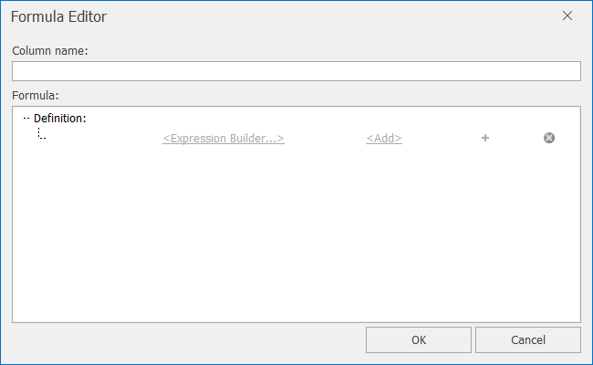
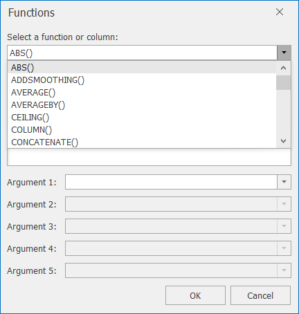
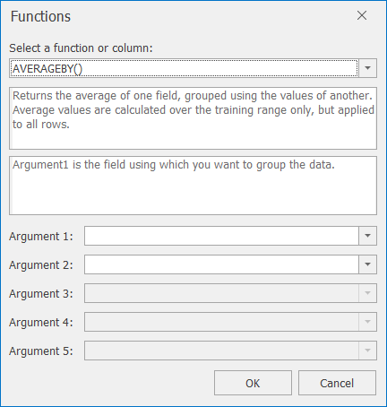
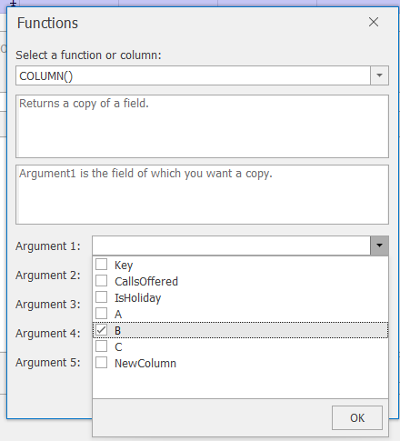
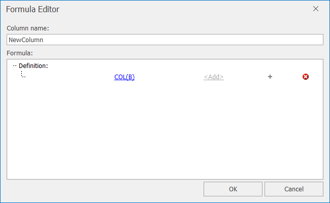
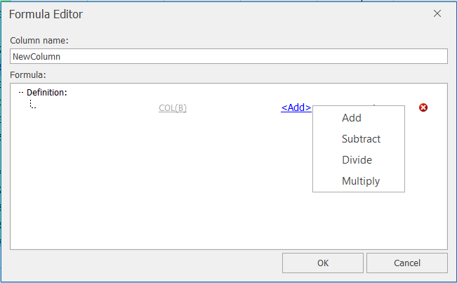
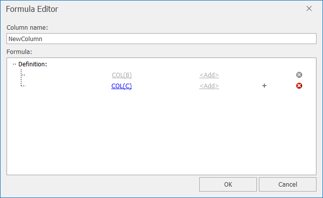
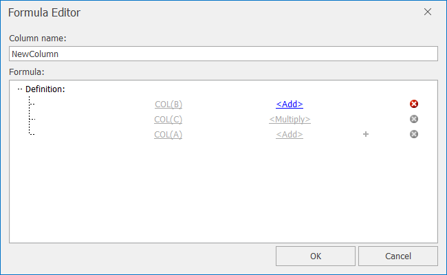

# The Formula Editor

The formula editor lets you create a new column using a formula, usually based on other data columns. This can be really helpful for instance for marketing data, where the effect of outbound activity typically only affects the customer's behaviour a few days or weeks later. Adding in a new formula column that is simply a delayed version of the outbound activity can be really useful in making best use of a model's inputs.

The formula editor lets you chain together any number of simple functions. These functions are designed to be reasonably familiar to Excel users, but also include some really useful time-based functions not present in Excel. These functions can be chained together by adding subtracting, multiplying, or dividing to let you produce reasonably complex expressions if needed. Other derived columns can also be used as input to a formula, making this even more powerful.

You can bring up the formula editor in a couple of ways:
1. To create a new derived column, click on the **New Column** button on the Data tab ribbon, then select *Add Formula*
2. For an existing derived column, click on **Colum Properties** on the Data tab ribbon, then click on the **Formula Editor** button
3. For an existing derived column, right-click on the column header in the data grid, then select **Properties**. This will bring up the *Column Properties* dialog, where you can again click on the **Formula Editor** button

The main Formula Editor dialog initially looks as follows, before any formula has been added:
 

The formula consists of a series of at least one function from the Expression Builder (listed in the table below), joined together by using the standard operators +, -, x or ÷.  This gives you the flexibility to build up potentially quite complex functions if needed.

| Functions    |              |            |             |
|--------------|--------------|------------|-------------|
| ABS          | COSHARMONIC  | IFLESS_EQ  | POLYASMOOTHING |
| ADDSMOOTHING | COSOFDOW     | LOG        | SIN            |
| AVERAGE      | EXP          | MAXCOL     | SINHARMONIC    |
| AVERAGEBY    | EXPSMOOTHING | MAXROW     | SINOFDOW       |
| CEILING      | FLOOR        | MINCOL     | SKIP           |
| COLUMN       | IFEQUAL      | MINROW     | SQRT           |
| CONCATENATE  | IFGREATER    | MOVAVERAGE | SUBSTRING      |
| CONSTANT     | IFGREATER_EQ | OFFSET     | SUM            |
| COS          | IFLESS       | PI         | WEEKDAY        |

These functions all have an overall description, as well as information on each parameter. It can be really useful to just browse through these functions in Forecaster, to see exactly what's available.

<!-- TO DO: Add in documentation of formula functions -->

Once you've given your new column a name, you can start building the formula by clicking on `<Expression Builder…>`. You can then choose a function from the drop-down list, as shown below.
 
 

Once you've chosen a function, a description of the function will be shown, along with a list of required arguments (parameters). By hovering over the text box for any argument its description will appear, as seen here:

In some cases, the argument can be selected from a drop-down list rather than by typing.

### Example
Suppose you want to create a new column which is a function of three other columns: `A x (B + C)`.  The order of precedence for this system is similar to how a basic calculator works - those functions higher up the calculation are completed first.  You therefore want to create the formula as `B + C x A`.

- First click on `<Expression Builder…>` and select the COLUMN() function which only requires one argument – the name of the column you want to use.  From the Argument 1 drop-down list, select column B.
 

 

- Clicking on OK will return you to the Formula Editor.
 

 

- You now want to add column C to this subtotal.  Currently the next operator is `+` (shown by `<Add>`).  By clicking on this, you can see that you can also use `-`, `÷` or `x`.  For now, you should use Add.

 

- Clicking on the `+` sign will bring up another expression builder

 

- Choose the second expression to be COLUMN(C)

 

- As this current subtotal should be multiplied by column A, you first need to change the second `<Add>` to `<Multiply>` from the drop-down list.

- Now add a third expression: COLUMN(A)

 

- Now that the third expression has been entered, you can click on OK.  Note that the third operator (`<Add>`) is ignored as there is no fourth expression

To delete any element of the formula press the red or grey `X` button to the right of each function definition.  

