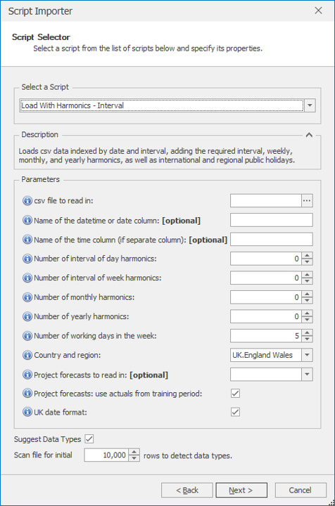

# *Load With Harmonics - Interval* Script Importer

This section covers how to use the *Load With Harmonics - Interval* importer. 

Once *Load With Harmonics - Interval* is selected from the drop-down at the top of the Script Selector dialog, you should see the parameters as shown below. You'll need to browse for the csv file to be read in, but apart from that you can very often run with the default parameters without needing to change anything else. The parameters and their effects are described here, but these details can also be found by hovering over the blue **(i)** icon in front of each parameter name.

 

## *Load With Harmonics - Interval* parameters

- **csv file to read in**: Select the csv file to read in. Comma separated files only are accepted.
- **Name of the datetime or date column**: If left blank, the first column in the file will be used as the date-time column. If date and time are in separate columns, the date column can be specified here (can be left blank if it's the first column).
- **Name of the time column (if separate column)**: The name of the time column, if time exists as a separate column from the date column. Otherwise, time is picked up from the datetime column.
- **Number of interval of day harmonics**: The number of interval of day harmonics columns to create. When added as inputs to forecast models
such as regression, they help the models handle intra-day seasonality. The recommended value is 5. Increasing this number will let a model handle spikier intra-day profiles, while decreasing it will lead to smoother intra-day profiles.
- **Number of interval of week harmonics**: The number of weekly harmonics columns to create. When added as inputs to forecast models such as regression, they help the models handle within-week seasonality. The recommended value is 5. Increasing this number will let a model handle spikier within-week profiles,
while decreasing it will lead to smoother within-week profiles.
- **Number of monthly harmonics**: The number of day of month harmonics columns to create. When added as inputs to forecast models such as regression, they help the models handle within-month seasonality. The recommended value is 4. Increasing this number will let a model handle spikier within-month profiles, while decreasing it will lead to smoother within-month profiles.
- **Number of yearly harmonics**: The number of day of year harmonics columns to create. When added as inputs to forecast models such as regression, they help the models handle within-year seasonality. The recommended value is 5. Increasing this number will let a model handle spikier within-year profiles, while decreasing it will lead to smoother within-year profiles.
- **Number of working days in the week**: Must be 5, 6, or 7. If 5, Monday to Friday are flagged as working days, if 6, Saturday is included as well, and if 7, all days are flagged as working days.
- **Country and region**: Public holidays will be appended for any country selected here. 
Within each country, holidays for any particular region can be selected (selecting a region will also bring back national level holidays). If 'National' is selected, only national holidays will be included. If 'All' is selected, all national and regional holidays will be included. The current list of countries covers:
    
    * Belgium: National holidays only
    * France: National and some regional holidays
    * Germany: National and regional holidays
    * Greece: National holidays only
    * Italy: National and regional holidays
    * Netherlands: National holidays only
    * Poland: National holidays only
    * Portugal: National holidays only
    * Ireland: National holidays only
    * Spain: National and regional holidays
    * UK: National and regional holidays
    * US: National and regional holidays
    
- **Project forecasts to read in**: This holds a drop-down list of all projects in the solution. Multiple projects can be selected, and forecasts from these projects will be read in as well. 
- **Project forecasts: use actuals from training period**: Applies to forecasts read in from other projects. If ticked, actual values will be used up to the first forecast row, and forecast values after that. If unticked, forecasts only are read in for all available rows.
- **UK date format**: If checked (the default), UK date format is assumed for the key column. If unchecked, US date format is assumed instead.

