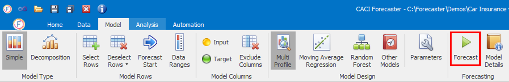
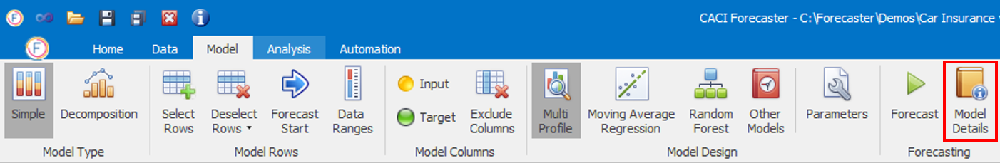

## Forecast Models

Forecaster lets you use a wide range of forecasting approaches or models. These range from simple seasonal profiles to more advanced techniques such as Random Forests. Each of these models is already set up with sensible default parameters, so can be used out of the box with a single click, without worrying about the details of the approach. However, if you do want more control over the details of a specific model, clicking on **Parameters** lets you view and edit the parameters used in training the model.

Once you've selected a forecast model, you can click on the **Forecast** button in the **Data – Forecasting** ribbon.  This will train the forecasting model on the data from the training range, and then used this model to the forecasts that then appear in the last two columns of the data grid: Forecast and Forecast Error.

Note that if the forecast model contains inputs, each input column needs to be populated with a forecast in order to provide a forecast for the target variable.

Progress on the forecast generation will be shown in the Output Window.  The performance of the forecast is now ready to be reviewed using the **Analysis** tab.

### Model Details

Once the forecast has been completed successfully, you can see the model's details by clicking on the relevant button as in the image below.

Depending on the model, you can find additional insights about the forecast model, such as prediction accuracy and importance of each input variable.

