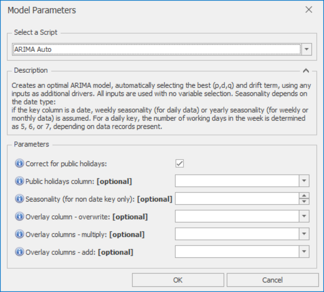

# *ARIMA Auto* Forecast Model

This section covers how to use the *ARIMA Auto* forecast model. ARIMA models are good at following trends, and can also learn from business drivers (inputs) when available. However, it uses all inputs, not selecting the best inputs only (use *Moving Average Regression* or *Random Forest* models for input selection). This *Auto* version searches for the optimal set of parameters. For more manual control, use *ARIMA-Manual* instead.

Once *ARIMA Auto* is selected from the drop-down at the top of the Script Selector dialog, you should see the parameters as shown below. You can very often run with the default parameters without needing to change anything else. The parameters and their effects are described here, but these details can also be found by hovering over the blue **(i)** icon in front of each parameter name.

 

## *ARIMA Auto* parameters

*ARIMA Auto* creates an optimal ARIMA model, automatically selecting the best (p,d,q) and drift term, using any inputs as additional drivers. All inputs are used with no variable selection. Seasonality depends on the date type:
if the key column is a date, weekly seasonality (for daily data) or yearly seasonality (for weekly or monthly data) is assumed. For a daily key, the number of working days in the week is determined as 5, 6, or 7, depending on data records present.

- **Correct for public holidays**: If selected, public holidays are removed from the ARIMA training data, 
and a public holiday scaling factor is then determined 
after the initial ARIMA forecast is produced
- **Public holidays column**: If left blank, defaults to one of IsHoliday, HolidaysInWeek, or HolidaysInMonth depending on date type
- **Seasonality (for non date key only)**: Only required or used if the key column is not a date. If the key column is a date, weekly or yearly seasonality is assumed. If no seasonality is present, leave blank or set to 1
- **Overlay column - overwrite**: Non-missing values in this column are used to overwrite the model forecast
- **Overlay columns - multiply**: Non-missing values in these columns are used to multiply the model forecast (after any overwrite overlays)
- **Overlay columns - add**: Non-missing values in these columns are added to the model forecast (after any multiplicative overlays)

