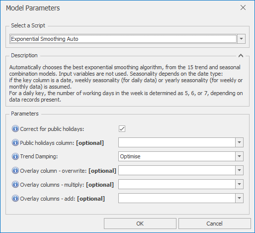

# *Exponential Smoothing Auto* Forecast Model

This section covers how to use the *Exponential Smoothing Auto* forecast model. Exponential smoothing models are basic models that can be good at following trends, as well as handling simple seasonality. They can be useful for simple yearly or monthly level forecasts, or as the trend following component of a decomposition model. This *Auto* version searches for the optimal set of parameters. For more manual control, use *Exponential Smoothing Manual* instead

Once *Exponential Smoothing Auto* is selected from the drop-down at the top of the Script Selector dialog, you should see the parameters as shown below. You can very often run with the default parameters without needing to change anything else. The parameters and their effects are described here, but these details can also be found by hovering over the blue **(i)** icon in front of each parameter name.

 

## *Exponential Smoothing Auto* parameters

*Exponential Smoothing Auto* automatically chooses the best exponential smoothing algorithm, from the 15 trend and seasonal combination models. Input variables are not used. Seasonality depends on the date type: if the key column is a date, weekly seasonality (for daily data) or yearly seasonality (for weekly or monthly data) is assumed. For a daily key, the number of working days in the week is determined as 5, 6, or 7, depending on data records present.
- **Correct for public holidays**: If selected, public holidays are removed from the ARIMA training data, 
and a public holiday scaling factor is then determined 
after the initial ARIMA forecast is produced
- **Public holidays column**: If left blank, defaults to one of IsHoliday, HolidaysInWeek, or HolidaysInMonth depending on date type
- **Trend Damping**: Can take one of the 3 following values:
    - *Optimise* (the default) selects the best model from damped and non-damped trend models
    - *Non-damped*: allows steeper trends by enforcing no limits on trend 
    - *Damped*: produces more conservative forecasts by using a damped trend
- **Overlay column - overwrite**: Non-missing values in this column are used to overwrite the model forecast
- **Overlay columns - multiply**: Non-missing values in these columns are used to multiply the model forecast (after any overwrite overlays)
- **Overlay columns - add**: Non-missing values in these columns are added to the model forecast (after any multiplicative overlays)

