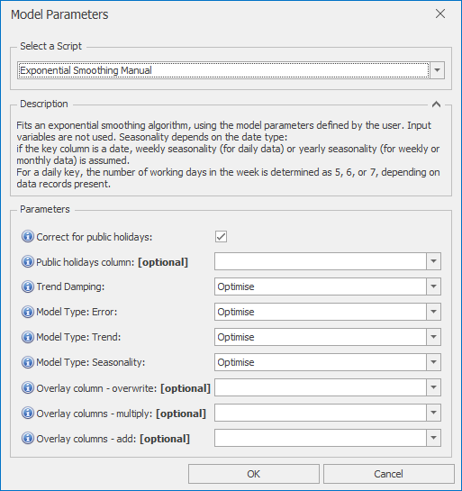

# *Exponential Smoothing Manual* Forecast Model

This section covers how to use the *Exponential Smoothing Manual* forecast model. Exponential smoothing models are basic models that can be good at following trends, as well as handling simple seasonality. They can be useful for simple yearly or monthly level forecasts, or as the trend following component of a decomposition model. This *Manual* version gives you the most control over individual model parameters. For more automation, use *Exponential Smoothing Auto* instead

Once *Exponential Smoothing Manual* is selected from the drop-down at the top of the Script Selector dialog, you should see the parameters as shown below. You can very often run with the default parameters without needing to change anything else. The parameters and their effects are described here, but these details can also be found by hovering over the blue **(i)** icon in front of each parameter name.

 

## *Exponential Smoothing Manual* parameters

*Exponential Smoothing Manual* fits an exponential smoothing algorithm, using the model parameters defined by the user. Input variables are not used. Seasonality depends on the date type: if the key column is a date, weekly seasonality (for daily data) or yearly seasonality (for weekly or monthly data) is assumed. For a daily key, the number of working days in the week is determined as 5, 6, or 7, depending on data records present.
- **Correct for public holidays**: If selected, public holidays are removed from the ARIMA training data, 
and a public holiday scaling factor is then determined 
after the initial ARIMA forecast is produced
- **Public holidays column**: If left blank, defaults to one of IsHoliday, HolidaysInWeek, or HolidaysInMonth depending on date type
- **Trend Damping**: Can take one of the 3 following values:
    - *Optimise* (the default) selects the best model from damped and non-damped trend models
    - *Non-damped*: allows steeper trends by enforcing no limits on trend 
    - *Damped*: produces more conservative forecasts by using a damped trend
- **Model Type: Error**: Can take one of the 3 following values:
    - *Optimise* (the default) automatically determines the best error type from Additive or Multiplicative
    - *Additive*: Additive means that the errors are applied linearly. Estimated forecast errors will not depend on the size of the forecast itself
    - *Multiplicative*: Multiplicative errors tends to scale better over large scale changes. Smaller forecasts will tend to have smaller errors, in proportion to the size of the forecast
    'Optimise' automatically determines the best trend type from None, Additive or Multiplicative
- **Model Type: Trend**: Can take one of the 3 following values:
    - *Optimise* (the default) automatically determines the best trend type from None, Additive or Multiplicative
    - *None*: Uses no trends in the model
    - *Additive*: Additive means that any trend is applied linearly. Trends will increase or decrease in a straight line
    - *Multiplicative*: Means that any trend is applied multiplicatively. This can lead to trends increasing very rapidly upwards, while downward trends will tend to flatten as they get closer to zero
- **Model Type: Seasonality**: Can take one of the 3 following values:
    - *Optimise* (the default) automatically determines the best seasonality type from None, Additive or Multiplicative
    - *None*: Uses no seasonality in the model
    - *Additive*: Additive means that any seasonality is applied linearly, with the size of seasonal changes being independent of any long term trends
    - *Multiplicative*: Means that any seasonality is applied multiplicatively, which tends to scale better over long term trends. Seasonal variation will be applied as a percentage, in proportion to the size of the forecast
- **Overlay column - overwrite**: Non-missing values in this column are used to overwrite the model forecast
- **Overlay columns - multiply**: Non-missing values in these columns are used to multiply the model forecast (after any overwrite overlays)
- **Overlay columns - add**: Non-missing values in these columns are added to the model forecast (after any multiplicative overlays)

