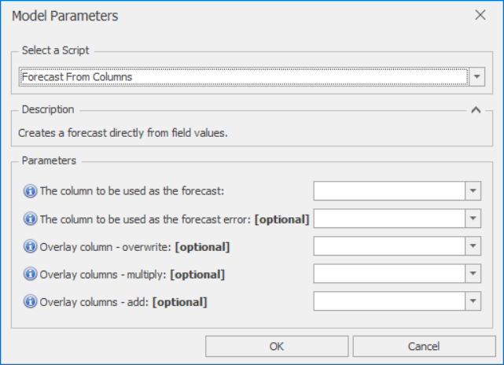

# *Forecast From Columns* Forecast Model

This section covers how to use the *Forecast From Columns* forecast model. Creates a forecast directly from input columns: one column is used as the Forecast, and another as the Forecast Error

Once *Forecast From Columns* is selected from the drop-down at the top of the Script Selector dialog, you should see the parameters as shown below. You can very often run with the default parameters without needing to change anything else. The parameters and their effects are described here, but these details can also be found by hovering over the blue **(i)** icon in front of each parameter name.

 

## *Forecast From Columns* parameters

- **The column to be used as the forecast**: Values from this column will be simply copied to the Forecast column (with any overlays applied if needed)
- **The column to be used as the forecast error**: Values from this column will be simply copied to the Forecast Error column (with any overlays applied if needed). Values should all be positive. If left blank, forecast errors will be set to zero
- **Overlay column - overwrite**: Non-missing values in this column are used to overwrite the model forecast
- **Overlay columns - multiply**: Non-missing values in these columns are used to multiply the model forecast (after any overwrite overlays)
- **Overlay columns - add**: Non-missing values in these columns are added to the model forecast (after any multiplicative overlays)