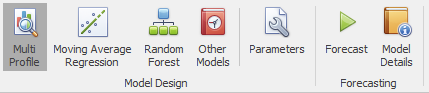
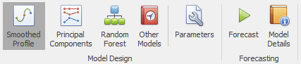

# All Forecasting Models
 

This sections gives details of all the Forecast Models (found in the Model Tab). These really are the core of Forecaster, and are the algorithms that produce the forecasts, based on learning from historical data and user overlays.
The first section to be added to the How To... section will cover the advantages and drawbacks of each of these models, as well as talking about the best places to use each of these.
For each data type (interval, daily, weekly, etc.), the top 3 models appear on individual buttons under the Model Design section of the Model tab. They can typically be run with default parameters, but the *Parameters* button provides details of the algorithm used, as well as information and control over all parameters. 


As a rule of thumb, for daily data or above it is always worth starting with simple seasonal models with few if any inputs, then moving to more advanced models that learn from inputs as appropriate. Those simple seasonal models are easy to interpret, are robust, and can work very well even when no business drivers are available. To get the absolute best forecasts, however, machines learning models such as Regression or Random Forests are recommended, in order to learn as much as possible from business drivers (inputs). For daily to monthly data, the relevant *Multi Profile Model* is recommended as a first model, moving then to *Moving Average Regression* or *Random Forest* as needed.


Interval level models are in a separate section below, as these typically work in a different way from daily and above models (although machines learning models such as *Moving Average Regression* or *Random Forest* can sometimes be used to great benefit on interval data, in particular when many business inputs are available).

## Multi Profile Models

Those simple seasonal models are easy to interpret, are robust, and can work very well even when no business drivers are available. They can work surprisingly well, and are always worth trying as a first pass on a new problem, even if only to set a quick performance benchmark. For more powerful machine learning, and to infer the effects of business drivers (inputs), look instead to the *Moving Average Regression* or *Random Forest* models under the **General Purpose Models** section below.

- [**Multi Profile Daily**](Multi-Profile-Daily.md): Creates a seasonal profile model for daily data, using weekly, monthly, and yearly profiles, as well as a moving average. If required, it also handles public holidays, by determining factors for public holidays and the days directly before and after a public holiday.

- [**Multi Profile Weekly**](Multi-Profile-Weekly.md): Creates a seasonal profile model for weekly data, using monthly and yearly profiles, as well as a moving average. If required, also determines a multiplicative factor for public holidays.

- [**Multi Profile Monthly**](Multi-Profile-Monthly.md): Creates a seasonal profile model for monthly data, using a combination of a moving average and a month of year profile. If required, also determines a multiplicative factor for public holidays.

## General Purpose Models

These models can typically be applied to any type of data, from interval to monthly, yearly, or even non time-based data. Random Forests can also be used to predict binary outcomes, such as churn.

- [**ARIMA Auto**](ARIMA-Auto.md): ARIMA models are good at following trends, and can also learn from business drivers (inputs) when available. This *Auto* version searches for the optimal set of parameters. For more manual control, use *ARIMA Manual* instead

- [**ARIMA Manual**](ARIMA-Manual.md): ARIMA models are good at following trends, and can also learn from business drivers (inputs) when available. This *Manual* version gives you the most control over individual model parameters. For more automation, use *ARIMA Auto* instead.

- [**Exponential Smoothing Auto**](Exponential-Smoothing-Auto.md): Exponential smoothing models are basic models that can be good at following trends, as well as handling simple seasonality. They can be useful for simple yearly or monthly level forecasts, or as the trend following component of a decomposition model. This *Auto* version searches for the optimal set of parameters. For more manual control, use *Exponential Smoothing Manual* instead

- [**Exponential Smoothing Manual**](Exponential-Smoothing-Manual.md): Exponential smoothing models are basic models that can be good at following trends, as well as handling simple seasonality. They can be useful for simple yearly or monthly level forecasts, or as the trend following component of a decomposition model. This *Manual* version gives you the most control over individual model parameters. For more automation, use *Exponential Smoothing Auto* instead

- [**Forecast From Columns**](Forecast-From-Columns.md): Creates a forecast directly from input columns: one column is used as the Forecast, and another as the Forecast Error

- [**Formula Forecast**](Formula-Forecast.md): Creates the forecast (and forecast error if needed) from user provided formulae

- [**Moving Average Regression**](Moving-Average-Regression.md): Stepwise regression, with both long term and short term moving averages to handle trends. This is one of the most useful Forecaster models, able to learn from business drivers, select the most useful ones, and provide feedback on their relative importance.
- [**Random Forest**](Random-Forest.md): Creates a random forest model, which is a combination of a large number of decision trees.  This model is more powerful than regression, and can also select inputs based on their significance.  Random Forests can also be used to predict binary outcomes, such as churn.

- [**Regression Line**](Regression-Line.md): Simply fits a straight line to the data from the training range, and uses this to forecast.

- [**STL Decomposition Auto**](STL-Decompositon-Auto.md): Creates a seasonal and trend decomposition model. This kind of model can handle trends and basic seasonality well, however, input variables are not used. 

- [**Weekly Profile**](Weekly-Profile.md): Creates a forecast based on the average value for each day of the week over the training set. If required, also handles public holidays, and determines factors for public holidays and the days directly before and after a public holiday.

## Interval Models
 
Forecaster provides a range of models for using on interval level data. This section covers models that are specifically designed for interval data. These models are generally based purely on seasonality, without using additional business drivers. Other models such as Regression or Random Forest can also be used on interval data. Although those other kinds of models are used less frequently on interval data, they can be extremely useful when business drivers are present.


It is generally recommended to use these specific interval level models for interval level data. If business drivers are available and relevant, these are generally defined at daily level, and can be more effectively used by daily level models. If daily forecasts are available, these daily forecasts can be used by the interval level models to define daily totals.


## Recommended process
1. Generate daily level forecasts in one project, using either Multi Profile Daily, or one of the other General Purpose models
2. Read in those forecasts to the interval level project (if using *Load With Harmonics Interval*, by selecting the daily level project in the *Project forecasts to read in* drop-down). These daily forecasts will then appear as an additional column in the interval level project
3. Create an interval level forecast using one of the specific interval level models, making sure to specify the daily forecast column in the *Match aggregate totals column* drop-down in the forecast model

This process will ensure that any daily business drivers are exploited by the daily level model, whilst ensuring that the interval model daily totals match those daily forecasts

### Allowed intervals
Any intervals that fit neatly within an hour are allowed (e.g. 12, 15, 30 minute intervals are allowed, 13 minute intervals are not). In addition, for intervals larger than an hour, hourly multiples are also allowed  (e.g. 2h, 3h intervals are allowed, 2h30 intervals are not).

- [**Weekly Interval Profile Smoothed**](Weekly-Interval-Profile-Smoothed.md): This is the default interval level model, and will appear as the first button on the model ribbon (as *Smoothed Profile*). This model creates a forecast based on the average value for each interval of the week over the training set. Recent weeks are given more weight than older weeks, and you can also include a percentage of the previous year's values.

- [**Weekly Interval Profile Principal Components**](Weekly-Interval-Profile-Principal-Components.md): Creates forecasts based on a combination of standard weekly profiles (called principal components). Standard weekly profiles are automatically learned from the data, then forecasts are created from a weighted combination of those profiles. This approach should work well for profiles that have consistent changes within the month or within the year.

- [**Weekly Interval Profile**](Weekly-Interval-Profile.md): The simplest interval level model. Creates a forecast based on the average value for interval of each day of the week over the training set. If required, also handles public holidays, by simply removing them from the training data.

