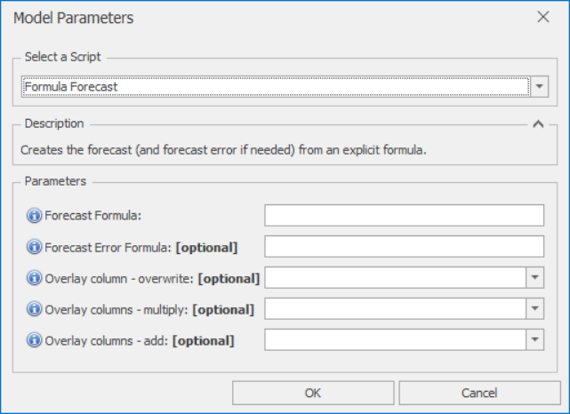

# *Formula Forecast* Forecast Model

This section covers how to use the *Formula Forecast* forecast model. This model lets you create the forecast (and forecast error if needed) by simply typing in formulae

Once *Formula Forecast* is selected from the drop-down at the top of the Script Selector dialog, you should see the parameters as shown below. You can very often run with the default parameters without needing to change anything else. The parameters and their effects are described here, but these details can also be found by hovering over the blue **(i)** icon in front of each parameter name.

 

## *Formula Forecast* parameters

- **Forecast Formula**: Any formula involving any of the input columns can be entered here. When referring to any column with special characters such as spaces in the name, these must be replaced by `.`. Must be a valid R expression
- **Forecast Error Formula**: Any formula involving any of the input columns can be entered here. If left blank, forecast error will be set to 0. When referring to any column with special characters such as spaces in the name, these must be replaced by `.`. Must be a valid R expression
- **Overlay column - overwrite**: Non-missing values in this column are used to overwrite the model forecast
- **Overlay columns - multiply**: Non-missing values in these columns are used to multiply the model forecast (after any overwrite overlays)
- **Overlay columns - add**: Non-missing values in these columns are added to the model forecast (after any multiplicative overlays)