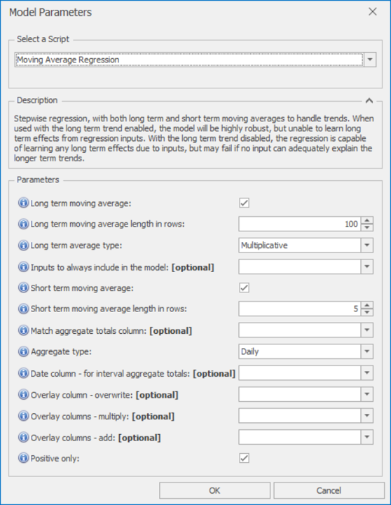

# *Moving Average Regression* Forecast Model

This section covers how to use the *Moving Average Regression* forecast model. This model is based on Stepwise regression, with the addition of both long term and short term moving averages to handle trends. This is one of the most useful Forecaster models, able to learn from business drivers, select the most useful ones, and provide feedback on their relative importance.

Once *Moving Average Regression* is selected from the drop-down at the top of the Script Selector dialog, you should see the parameters as shown below. You can very often run with the default parameters without needing to change anything else. The parameters and their effects are described here, but these details can also be found by hovering over the blue **(i)** icon in front of each parameter name.

 

## *Moving Average Regression* parameters

When used with the long term trend enabled, the model will be highly robust, but unable to learn long term effects from regression inputs (as these are hidden by the trend removal). With the long term trend disabled, the regression is capable of learning any long term effects due to inputs, but may fail if no input can adequately explain the longer term trends.

- **Long term moving average**: If selected, uses an Exponential Moving Average to follow any long term trends. The length of this moving average is set using the parameter below.
- **Long term moving average length in rows**: Moving average length in rows for the long term moving average. Only applies if 'Long term moving average above' is selected. The target value is first detrended by first removing this long term trend, then the regression model is trained and used to produce a first forecast. Finally this forecast is then scaled back up by factoring the trend back in.
- **Long term average type**: How to remove the long term trend. The default is Multiplicative, where the target is divided by the long term trend. Additive means that the long term trend is to be subtracted from the target instead. Multiplicative tends to scale better over large scale changes.
- **Inputs to always include in the model**: The columns selected here will always be used by the model, even if not statistically significant. NB: These columns must also be flagged up as Input to be used.
- **Short term moving average**: If selected, uses an Exponential Moving Average to follow any short term trends. The length of this moving average is set using the parameter below.
- **Short term moving average length in rows**: Moving average length in rows for the short term moving average. Only applies if 'Short term moving average above' is selected.
- **Match aggregate totals column**: If selected, total forecasts will be scaled to match the aggregate totals from this column (daily, weekly, or monthly). This is particularly useful when creating interval level forecasts, when you want the totals (daily, weekly, or monthly) to match those already provided, or created by another forecast
- **Aggregate type**: The aggregation level of the totals column
- **Date column - for interval aggregate totals**: Only needed when matching aggregate totals in an interval level project
- **Overlay column - overwrite**: Non-missing values in this column are used to overwrite the model forecast
- **Overlay columns - multiply**: Non-missing values in these columns are used to multiply the model forecast (after any overwrite overlays)
- **Overlay columns - add**: Non-missing values in these columns are added to the model forecast (after any multiplicative overlays)