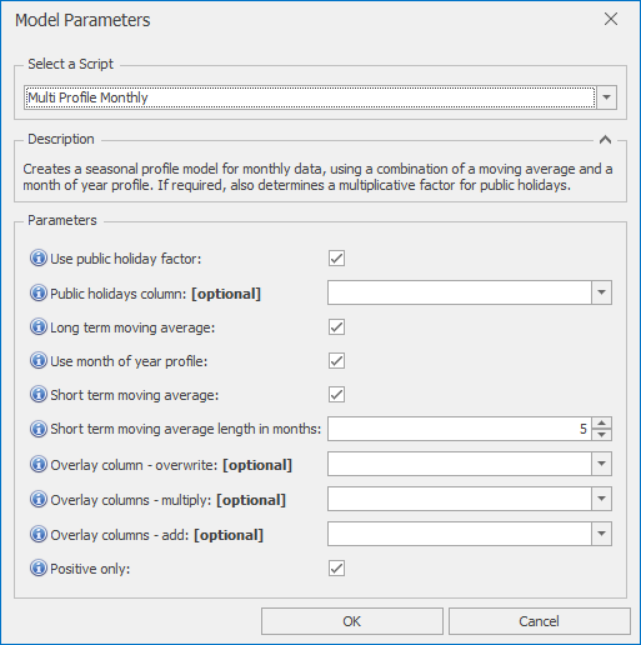

# *Multi Profile Monthly* Forecast Model

This section covers how to use the *Multi Profile Monthly* forecast model. Those simple seasonal models are easy to interpret, are robust, and can work very well even when no business drivers are available. They can work surprisingly well, and are always worth trying as a first pass on a new problem, even if only to set a quick performance benchmark. For more powerful machine learning, and to infer the effects of business drivers (inputs), look instead to the *Moving Average Regression* or *Random Forest* models under the **Generic Models** section below.

If the project holds monthly data, you can select a *Multi Profile Monthly* model from the **Multi Profile** button on the *Model Design* section of the *Model* Forecaster tab. (For a new project, this is selected by default). To view model details and parameters, click on the *Parameters* button, to bring up the *Model Parameters* dialog. You can very often run with the default parameters without needing to change anything else. The parameters and their effects are described here, but these details can also be found by hovering over the blue **(i)** icon in front of each parameter name.

 

## *Multi Profile Monthly* parameters

*Multi Profile Monthly* creates a seasonal profile model for monthly data, using a combination of a moving average and a month of year profile. If required, also determines a multiplicative factor for public holidays.

- **Use public holiday factors**: If selected, a multiplicative factor is applied for the number of public holidays in the month
- **Public holidays column**: If missing, defaults to HolidaysInMonth
- **Long term moving average**: If deselected, no trends are assumed. If selected, uses an Exponential Moving Average to follow any long term trends. The length of this moving average is determined automatically from the data
- **Use month of year profile**: Use this if a yearly profile is expected. 2 years' worth of data is recommended to be able to identify seasonality well. If strong seasonality is known to be present, less than 2 years can be used.
- **Short term moving average**: If selected, uses an Exponential Moving Average to follow any short term trends. The length of this moving average is set using the parameter below. If 'Positive only' is selected below, this moving average will be multiplicative, otherwise it will be additive. 
- **Short term moving average length in months**: Moving average length in days for the short term moving average. Only applies if 'Short term moving average above' is selected.
- **Overlay column - overwrite**: Non-missing values in this column are used to overwrite the model forecast
- **Overlay columns - multiply**: Non-missing values in these columns are used to multiply the model forecast (after any overwrite overlays)
- **Overlay columns - add**: Non-missing values in these columns are added to the model forecast (after any multiplicative overlays)
- **Positive only**: Select this if forecasts are strictly positive or zero.

