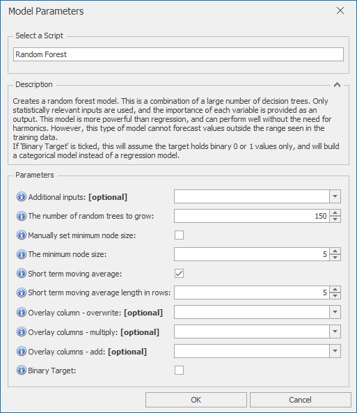

# *Random Forest* Forecast Model

This section covers how to use the *Random Forest* forecast model. This is a combination of a large number of decision trees. Only statistically relevant inputs are used, and the importance of each variable is provided as an output. This model is more powerful than regression, and can perform well without the need for harmonics. However, this type of model cannot forecast values outside the range seen in the training data.

If 'Binary Target' is ticked, this will assume the target holds binary 0 or 1 values only, and will build a categorical model instead of a regression model.

Once *Random Forest* is selected from the drop-down at the top of the Script Selector dialog, you should see the parameters as shown below. You can very often run with the default parameters without needing to change anything else. The parameters and their effects are described here, but these details can also be found by hovering over the blue **(i)** icon in front of each parameter name.

 

## *Random Forest* parameters

- **Additional inputs**: The columns selected here will also be used as model inputs. This allows non-numeric inputs to be added. Any inputs here will be not be used if they have more than 53 distinct levels.
- **The number of random trees to grow**: Using 150 trees is recommended. For better accuracy, increase the number of trees to 500 or above (forecasting will take longer as a result). For faster forecasting and lower memory usage, this can be dropped, at the risk of potentially decreased performance. Minimum number of trees is 2.
- **Manually set minimum node size**: Use this to manually set the minimum node size - the number of training examples in each node at which to stop growing the tree. The number is set in the box below. The default is 5, and increasing this value will lead to smaller trees. This may increase performance on large datasets, by allowing larger trees to be grown and still fit in memory.
- **The minimum node size**: If the tick box above is selected, this can be used to manually set the minimum node size - the number of training examples in each node at which to stop growing the tree. The default is 5, and increasing this value will lead to smaller trees. This may increase performance on large datasets, by allowing larger trees to be grown and still fit in memory.
- **Short term moving average**: If selected, uses an Exponential Moving Average to follow any short term trends. The length of this moving average is set using the parameter below.
- **Short term moving average length in rows**: Moving average length in rows for the short term moving average. Only applies if 'Short term moving average above' is selected.
- **Overlay column - overwrite**: Non-missing values in this column are used to overwrite the model forecast
- **Overlay columns - multiply**: Non-missing values in these columns are used to multiply the model forecast (after any overwrite overlays)
- **Overlay columns - add**: Non-missing values in these columns are added to the model forecast (after any multiplicative overlays)
- **Binary Target**: If ticked, this model will assume the target holds binary 0 or 1 values only, and will build a categorical model instead of a regression model