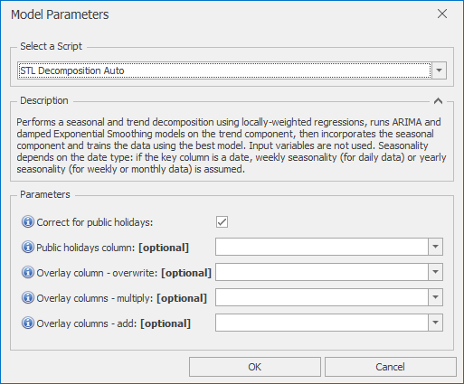

# *STL Decomposition Auto* Forecast Model

This section covers how to use the *STL Decomposition Auto* forecast model. This performs a seasonal and trend decomposition using locally-weighted regressions, runs ARIMA and damped Exponential Smoothing models on the trend component, then incorporates the seasonal component and trains the data using the best model. Input variables are not used. Seasonality depends on the date type: if the key column is a date, weekly seasonality (for daily data) or yearly seasonality (for weekly or monthly data) is assumed. 

Once *STL Decomposition Auto* is selected from the drop-down at the top of the Script Selector dialog, you should see the parameters as shown below. You can very often run with the default parameters without needing to change anything else. The parameters and their effects are described here, but these details can also be found by hovering over the blue **(i)** icon in front of each parameter name.

 

## *STL Decomposition Auto* parameters

- **Correct for public holidays**: If selected, public holidays are removed from the ARIMA training data, and a public holiday scaling factor is then determined after the initial ARIMA forecast is produced
- **Public holidays column**: If left blank, defaults to one of IsHoliday, HolidaysInWeek, or HolidaysInMonth depending on date type
- **Overlay column - overwrite**: Non-missing values in this column are used to overwrite the model forecast
- **Overlay columns - multiply**: Non-missing values in these columns are used to multiply the model forecast (after any overwrite overlays)
- **Overlay columns - add**: Non-missing values in these columns are added to the model forecast (after any multiplicative overlays)
