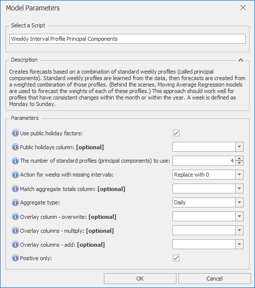

# *Weekly Interval Profile Principal Components* Forecast Model

This section covers how to use the *Weekly Interval Profile Principal Components* forecast model. Creates forecasts based on a combination of standard weekly profiles (called principal components). Standard weekly profiles are learned from the data, then forecasts are created from a weighted combination of those profiles. (Behind the scenes, Moving Average Regression models are used to forecast the weights of each of these profiles.) This approach should work well for profiles that have consistent changes within the month or within the year. A week is defined as Monday to Sunday.

Once *Weekly Interval Profile Principal Components* is selected from the drop-down at the top of the Script Selector dialog, you should see the parameters as shown below. You can very often run with the default parameters without needing to change anything else. The parameters and their effects are described here, but these details can also be found by hovering over the blue **(i)** icon in front of each parameter name.

 

## *Weekly Interval Profile Principal Components* parameters

- **Use public holiday factors**: If selected, public holidays information is used to increase accuracy
- **Public holidays column**: If left blank, defaults to IsHoliday
- **The number of standard profiles (principal components) to use**: If this number is increased, the model will be more able to handle complex behaviour. However, adding in too many components may lead to less accurate forecasts, as the model can overfit the training data. 4 is a sensible initial default value to use.
- **Action for weeks with missing intervals**: Action to take for weekly profiles with missing intervals. Principal Components cannot handle missing
values, so either these weeks must be dropped, or missing values must be replaced, either with 0 or with the mean for that interval.
- **Match aggregate totals column**: If selected, total forecasts will be scaled to match the aggregate totals from this column (must be daily, weekly, or monthly)
- **Aggregate type**: The aggregation level of the totals column (Daily, Weekly, or Monthly)
- **Overlay column - overwrite**: Non-missing values in this column are used to overwrite the model forecast
- **Overlay columns - multiply**: Non-missing values in these columns are used to multiply the model forecast (after any overwrite overlays)
- **Overlay columns - add**: Non-missing values in these columns are added to the model forecast (after any multiplicative overlays)
- **Positive only**: Select this if forecasts are to be strictly positive or zero