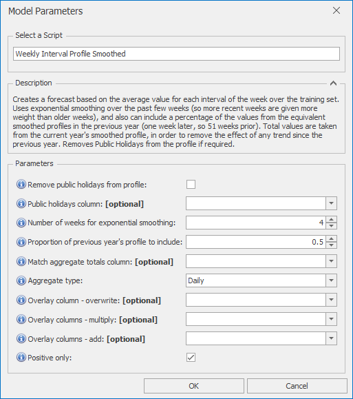

# *Weekly Interval Profile Smoothed* Forecast Model

This section covers how to use the *Weekly Interval Profile Smoothed* forecast model. This model creates a forecast based on the average value for each interval of the week over the training set. It uses exponential smoothing over the past few weeks (so more recent weeks are given more weight than older weeks), and also can include a percentage of the values from the equivalent smoothed profiles in the previous year (one week later, so 51 weeks prior). Total values are taken from the current year's smoothed profile, in order to remove the effect of any trend since the previous year. Removes Public Holidays from the profile if required.

Once *Weekly Interval Profile Smoothed* is selected from the drop-down at the top of the Script Selector dialog, you should see the parameters as shown below. You can very often run with the default parameters without needing to change anything else. The parameters and their effects are described here, but these details can also be found by hovering over the blue **(i)** icon in front of each parameter name.

 

## *Weekly Interval Profile Smoothed* parameters

- **Remove public holidays from profile**: If selected, public holidays are removed when determining the historical profile, and set to blank in the forecast.
- **Public holidays column**: If left blank, defaults to IsHoliday
- **Number of weeks for exponential smoothing**: Number of weeks for profile smoothing (1: no smoothing, larger numbers for longer smoothing periods). This uses exponential smoothing, so will give more weight to more recent weeks
- **Proportion of previous year's profile to include**: Can take any value between 0 and 1, where 0: use only this year's profile, 1: use only last year's profile
- **Match aggregate totals column**: If selected, total forecasts will be scaled to match the aggregate totals from this column (daily, weekly, or monthly)
- **Aggregate type**: The aggregation level of the totals column (Daily, Weekly, or Monthly)
- **Overlay column - overwrite**: Non-missing values in this column are used to overwrite the model forecast
- **Overlay columns - multiply**: Non-missing values in these columns are used to multiply the model forecast (after any overwrite overlays)
- **Overlay columns - add**: Non-missing values in these columns are added to the model forecast (after any multiplicative overlays)
- **Positive only**: Select this if forecasts are to be strictly positive or zero