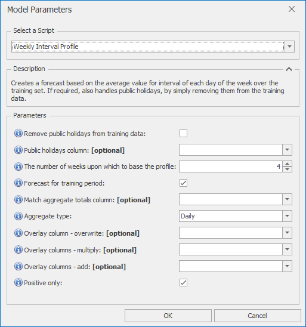

# *Weekly Interval Profile* Forecast Model

This section covers how to use the *Weekly Interval Profile* forecast model. Creates a forecast based on the average value for interval of each day of the week over the training set. If required, also handles public holidays, by simply removing them from the training data.

Once *Weekly Interval Profile* is selected from the drop-down at the top of the Script Selector dialog, you should see the parameters as shown below. You can very often run with the default parameters without needing to change anything else. The parameters and their effects are described here, but these details can also be found by hovering over the blue **(i)** icon in front of each parameter name.

 

## *Weekly Interval Profile* parameters

- **Remove public holidays from training data**: If selected, public holidays are removed from the training data used to generate the profiles
- **Public holidays column**: If left blank, defaults to IsHoliday
- **The number of weeks upon which to base the profile**: The value forecast for each interval of the week will be a simple moving average for this interval over this number of weeks. 4 is often a sensible default value.
- **Forecast for training period**: If selected, forecasts are also generated over the training period (this is recommended, but can be turned off to increase speed if needed)
- **Match aggregate totals column**: If selected, total forecasts will be scaled to match the aggregate totals from this column (daily, weekly, or monthly)
- **Aggregate type**: The aggregation level of the totals column (Daily, Weekly, or Monthly)
- **Overlay column - overwrite**: Non-missing values in this column are used to overwrite the model forecast
- **Overlay columns - multiply**: Non-missing values in these columns are used to multiply the model forecast (after any overwrite overlays)
- **Overlay columns - add**: Non-missing values in these columns are added to the model forecast (after any multiplicative overlays)
- **Positive only**: Select this if forecasts are to be strictly positive or zero
