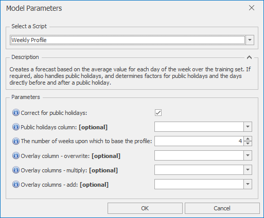

# *Weekly Profile* Forecast Model

This section covers how to use the *Weekly Profile* forecast model. THis model creates a forecast based on the average value for each day of the week over the training set. If required, also handles public holidays, and determines factors for public holidays and the days directly before and after a public holiday. This model applies to daily data only.

Once *Weekly Profile* is selected from the drop-down at the top of the Script Selector dialog, you should see the parameters as shown below. You can very often run with the default parameters without needing to change anything else. The parameters and their effects are described here, but these details can also be found by hovering over the blue **(i)** icon in front of each parameter name.

 

## *Weekly Profile* parameters

- **Correct for public holidays**: If selected, public holidays (and the days directly before and after them) are removed from the training data, and public holiday scaling factors (for public holidays, and the days directly before and after them) are then determined after the initial forecast is produced
- **Public holidays column**: If left blank, defaults to IsHoliday
- **The number of weeks upon which to base the profile**: The value forecast for each day of the week will be a simple moving average for this day of the week over this number of weeks. 4 is often a sensible default value.
- **Overlay column - overwrite**: Non-missing values in this column are used to overwrite the model forecast
- **Overlay columns - multiply**: Non-missing values in these columns are used to multiply the model forecast (after any overwrite overlays)
- **Overlay columns - add**: Non-missing values in these columns are added to the model forecast (after any multiplicative overlays)

