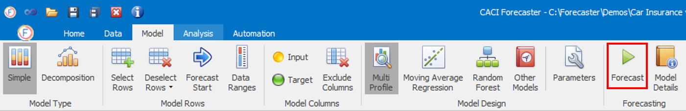
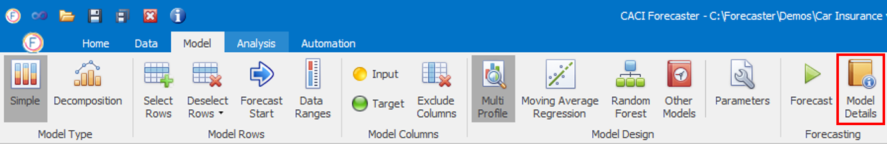

# Model Tab Forecasting Section

## Forecasting

Once you've selected a forecast model, you can click on the **Forecast** button in the **Data – Forecasting** ribbon.  This will populate the last two columns in the data grid, Forecast and Forecast Error:
- **Forecast** column holds the forecast created for the target column, which will generally be populated for all selected rows of the data grid  
- **Forecast Error** holds the accuracy estimate for this forecast, in the same units as the forecast itself. So, for example, if for a daily call volume forecast, *Forecast* is 100 and *Forecast Error* is 20, this means that the model estimates forecast volumes will be 100 on that day, with an estimated accuracy of 20 calls. This *Forecast Error* is the one standard deviation estimate, so this implies that actuals should fall within this range around 68% of the time. (Doubling this range would be 2 standard deviations, and imply a 95% confidence of actuals falling within the range.)


Note that if the forecast model contains inputs, each input column needs to be populated with a forecast in order to provide a forecast for the target variable. If an input is not populated in the forecast range, it may be worth first generating a forecast for this input in a second project, then reading those forecast values into the main project. This reading in of forecasts from other projects can be done by specifying the other project in the *Project forecasts to read in* parameter of the relevant *Load With Harmonics* data importer.


Progress on the forecast generation will be shown in the Output Window.  The performance of the forecast is now ready to be reviewed using the **Analysis** tab.

## Model Details

Once the forecast has been created, you can see the model's details by clicking on the relevant button as in the image below.

Depending on the model, this will show additional information about the forecast model, such as prediction accuracy and importance of each input variable.

