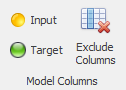
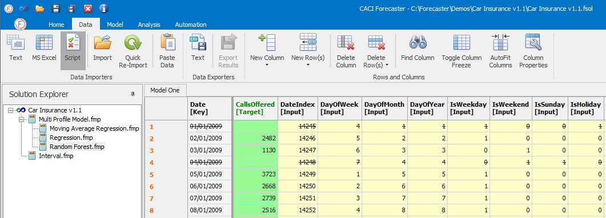

# Model Columns

The *Model Columns* section of the *Model* ribbon lets you select which columns to use as the model target (the column to forecast), and which can be used as inputs.

## Selecting Columns
Columns can be flagged up as one of two types: 
-	**Input**:  Column is allowed as an input to the forecast model (provided the model in question uses inputs). For some models, all input columns will be used, however, for more powerful models such as *Moving Average Regression* or *Random Forest*, the models themselves will learn which of these permitted inputs are relevant, and will usually just chose a subset of these input columns.
-	**Target**:  Column to be forecast (only one can be selected)

To flag up a column as a given column type, select the column or range of columns. (Multiple columns can be selected using the `shift` key.) The selected columns will turn light blue as selected.  At this point you can select one of the column types: Input or Target.  
Once complete, the column background colour will change to reflect the colours of the column type: inputs are yellow whilst the target column is green, as shown below.
 

## Excluding Columns
To exclude any data columns from any specific model (either as input or target), select the columns and then press the **Exclude Columns** button. This will not delete the columns, but will remove them from the model. The background colour of these columns will be returned to white.
(To delete columns completely, you should instead use the **Delete Column** button on the *Data* tab.)
