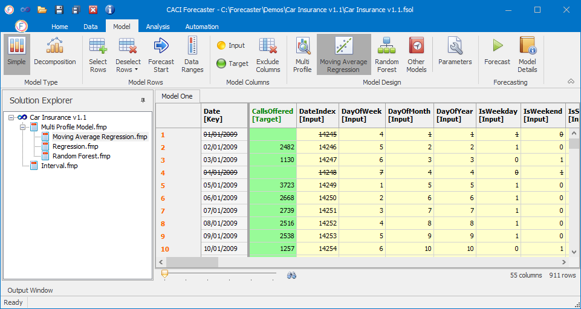

# Model Columns
This part of the Model ribbon  on defining or removing a column’s type, as described in the following sections.

### Column Types
Two types of column specification are possible in Forecaster: 
-	**Input**:  Column is used as an input to the forecast model (provided inputs are permitted in the forecast model)
-	**Target**:  Column to be forecasted (only one can be selected)
To assign a column to a given column type, select the column name or range of columns of interest.  Multiple columns can be selected using the `shift` key. The columns will turn blue is selected.  At this point press one of the column types: Input or Target.  
Once complete, the column background colour will change to reflect the colours of the column type: inputs are yellow whilst the target column is green.  The data grid should then appear similar to that shown in Figure 35.
 

### Excluding Columns
To exclude any data columns from any specific model (either as input or target), select the columns and then press the **Exclude Columns** button. This will not delete the columns, but will remove them from the model. The background colour of these columns will be returned to white.
To delete columns completely, you can instead use the **Delete Column** button on the *Data* tab.
