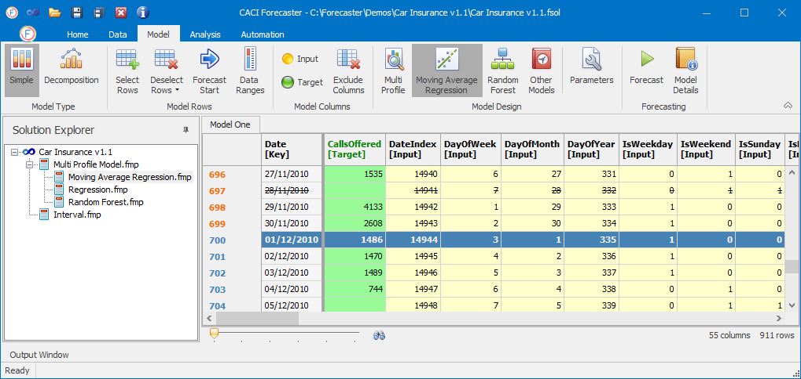
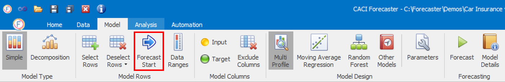
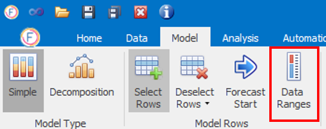
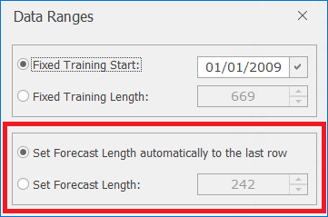
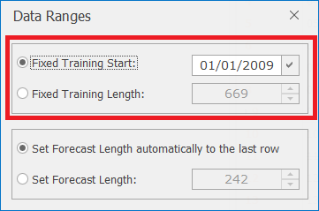

# Model Rows

When building a forecast, managing which rows to select and use for forecasting gives you a great deal of control over how forecasts are built. Specifying training and forecast ranges is usually the first step in setting up a forecast: this defines which rows Forecaster should use for learning and building forecasting models, and which rows should be used for forecasting. Rows can also be deselected manually, which is done typically in order to handle spurious or irrelevant data.

The screenshot above shows how training, forecast, and deselected rows are displayed. Training rows (used for building a model) have their column index highlighted in orange. Training rows are highlighted in blue. The Forecast Start Point (the first row of the forecast range) is highlighted in dark blue. Any deselected row (the 28th November row here, for example) is shown with a strike-through.

## Forecast Range

### Forecast Range basics
The Forecast Range holds the rows Forecaster will not use for building the model, but for which it will generate a forecast. When used to generate a live forecast, this forecast range would typically start on the first row for which target values are not available (usually tomorrow, if the data feed is live). However, when building and comparing models, it may well be worth setting the forecast range to start a few rows before you run out of target values. This is best practice, and lets you compare the forecasts with actuals on data not used for training. The forecast accuracy metrics shown in the chart legends (RMS, MAE) are calculated purely from the forecast range, in order to provide a true out-of-sample measure of forecast accuracy.

The first row of this training range is called the *Forecast Start Point*. To set this, highlight the row (by clicking on the column index) and press the **Forecast Start** button in the *Model Rows* section of the Model ribbon. 

The highlighted row will turn dark blue. All rows prior to this point will then be in the training range (shown by orange row indices), and all rows following the Forecast Start Point will have their indices highlighted in blue, to show that they all form part of the forecast range.


In fact, most models will produce forecasts for all rows, not just the rows in the forecast range. This let you compare forecasts with actuals throughout the training period, which can be hugely valuable in understanding a model's strengths and weaknesses. Looking at rows in the training data where the forecasts differ from actuals can often be very helpful in letting you improve the model. If a particular row's forecast doesn't match actuals, is this something we would expect? If this is a spurious data point, it may be worth deselecting the row, if you feel it will not be helpful in building a good model. More interestingly, if it *should* be possible to forecast this row more accurately, this can lead to the search for new model inputs. For example, if marketing or weather data were sourced and added to the project, maybe this would help improve performance by allowing the model to match better on those specific days.


### Forecast Range advanced

More control over the forecast range can be found in the *Data Ranges* dialog, reached from the *Data Ranges* button on the ribbon.

In this *Data Ranges* dialog, the forecasting data set can be selected in two ways:
- The default is to run the Forecast Range right to the end of the dataset
- You can also specify a fixed Forecasting Length (for example, if you always want to forecast 2 weeks ahead). This scan be useful in making sure the accuracy metrics on the charts are based on the period you've selected here: useful for instance if you're interested in measuring accuracy maybe over the next week rather than over all remaining rows.

## Training Range
The training range defines which rows Forecaster uses in order to build a model. This range should hold all the data that is relevant for generating a good forecast model. Typically this range should hold as much data as possible that is still relevant. This range may often contain all the historical data available. Alternatively, older data (or specific periods) may be omitted from the training range if it is deemed no longer relevant to creating a good forecast. Forecaster lets you control this training range very simply and graphically.
If you've set the Forecast Range by simply clicking the *Forecast Start* button, the training range will, by default, hold all rows prior to that row. You should see the row headings highlighted in orange, to show they're part of the training range.

There are a couple of ways in which you can have more fine-grained control over the training range:

- You can specify a fixed training data start point. This means that rows prior to this row will not form part of the training range. To do this:
    - Scroll to the appropriate row in the data grid, highlight the row number and click on the **Data Ranges** button
    - Click the tick symbol next to *Fixed Training Start* to update the training starting point to the currently selected row

- You can also specify a fixed training length (for example, if you always want to use 2 years’ worth of data in the training set):
    - In the same *Data Ranges* dialog, select *Fixed Training Length* and change the number to the fixed number of rows you want included in the training data set. This ensures that as you move the *Forecast* start point, the *Training* start point will also be moved automatically, to make sure the training range's length stays fixed to this value.
    

## Selecting/Deselecting Rows
Forecaster also lets you deselect and reselect individual rows of data.  Deselecting rows could be necessary because of missing values or because certain rows contain unusual data which you wouldn't want a forecast model to use.  

Selecting or deselecting a row can be done in two different ways:

- Left-click the row header (to the left of the grid) and then click on either the **Select Rows** or **Deselect Rows** buttons in the *Data – Model Rows* ribbon.  Multiple rows can be selected using the `shift` key.
- After selecting at least one row, right-click on a selected row number and choose **Select/Deselect** from the list of options

In certain cases you may want to deselect rows for which the target column is either missing or zero. (This should not occur very often, as forecast models generally ignore rows with missing target values. Rows in which the target value is zero are also worth training on in the vast majority of cases). Once you have set the target column (as described in next section - [Model Columns](Model-Columns.md#column-types)), you can deselect any blank or zero target values in a couple of steps:

- Select all rows by clicking on the blank column heading above the row numbers
- Right-click on any row number so that the list of row options appears.  Select **Deselect Blank Targets**, or **Deselect Zero Targets**
