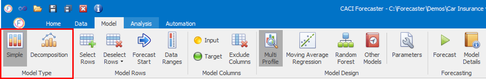

# Model Type

Forecaster lets you create two different types of forecast models:

-	**Simple Model**: This is the default, and uses a single model for forecasting
-	**Decomposition Model**: A more advanced approach, which lets you run two different forecasting methods on different parts of the data.  One particular use for this is to split your data into trend and seasonal components, which lets you use a different forecasting method on each component before re-combining the two to form the final forecast

<!-- A separate document describing decomposition models can be obtained by CACI [1]. -->
