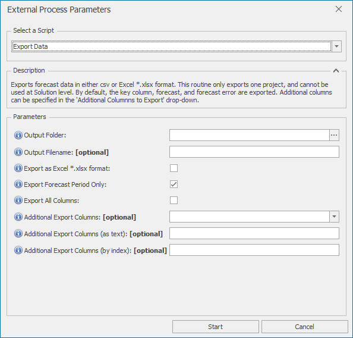

# *Export Data* External Process
This External Process provides a very flexible means of exporting data from Forecaster, and can save in both comma separated csv format and to Excel xlsx format.  It provides similar functionality to the inbuilt *Data Exporter* functionality (TO DO: see **here**), but has a little more flexibility in data formats and range filtering.

## Parameters
 You can also get parameter information within Forecaster, by hovering over the blue **(i)** information icons
* **Output Folder**: The output folder to which the data should be exported
* **Output Filename**: The name of the file to which the data should be exported. If empty, the project's name will be used
* **Export as Excel .xlsx format**: If ticked, will export as Excel *.xlsx format, rather than the default csv format
* **Export Forecast Period Only**: If selected, only data from the forecast period will be exported.  If deselected, all rows are exported
* **Export All Columns**: If ticked, all columns will be exported
* **Additional Export Columns**: The columns selected from this drop-down will be exported, in addition to the key, forecast, and forecast error columns which are always exported
* **Additional Export Columns (as text)**: These columns will be exported, in addition to the key, forecast, and forecast error columns which are always exported.  Any number of columns can be specified here, separated by commas. This option can be useful in workflows where the drop-down column names above may not be available
* **Additional Export Columns (by index)**: The columns with indexes specified here will be exported, in addition to the key, forecast, and forecast error columns which are always exported. Any number of columns can be specified here, separated by commas. Index ranges (e.g. 4-8) can also be used. This option can be useful in workflows where the drop-down column names above may not be available
