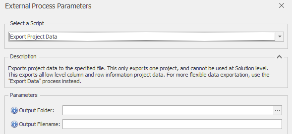
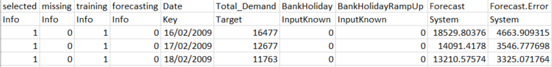

# *Export Project Data* External Process

This *Export Project Data* External Process exports all low level column and row information project data, and is really designed *only* for reading into other systems and diagnostic use.  For more flexible data exportation and a simpler output, it is usually preferable to use the standard "Export Data" process instead.

This process exports project data to the specified file.  This only exports one project, and cannot be used at Solution level.  

Data is saved in comma-separated csv format.  An example of output data is shown below.

## Parameters
 You can also get parameter information within Forecaster, by hovering over the blue **(i)** information icons
* **Output Folder**: The output folder to which the data should be exported
* **Output Filename**: The name of the file to which the data should be exported

## Output format

This process exports additional information columns:
* **selected**: This column holds 1 for all rows that are selected, and 0 for all deselected rows.  This flag is controlled by the user de-selecting and selecting rows in the Forecaster's main data grid
* **missing**: This column holds 1 for all missing rows (rows that are all blank), and 0 if any column (apart from the key column) in the row has a non-missing value.  This flag is set automatically by Forecaster based on the data in each row
* **training**: This column holds 1 for all rows in the training range, and 0 otherwise
* **forecasting**: This column holds 1 for all rows that are in the forecast range, and 0 otherwise

The first row in the output file holds the column headers, and the second row holds information on the usage of each column (for instance whether it is an input or target column).  Data is exported from row 3 onwards.
The possible values for the column information row are:
* **Info**: System information columns (not directly visible to the user in Forecaster).  The 4 columns just described are all *Info* type columns 
* **Key**: Identifies the key column.  This is the first column in the grid shown in Forecaster, and is usually the date or datetime column.
* **InputKnown**: This indicates that this column has been flagged up for use as a model input
* **Target**: This indicates that this column is flagged up for use as the model target
* **System**: Columns populated by Forecaster - typically just the *Forecast* and *Forecast Error* columns

