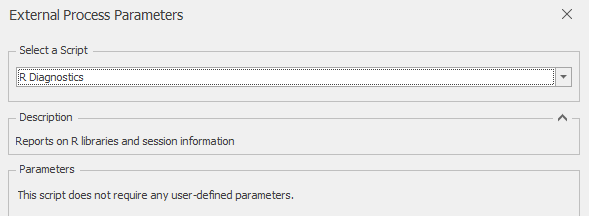

# *R Diagnostics* External Process

The *R Diagnostics* external process provides detailed diagnostic information on the current R installation, including version information and packages loaded.  This process is usually only called on for debugging and system validation.

No parameters are required to run this process. Outputs include the library paths used (from .libPaths()), as well as session information returned by sessionInfo().

