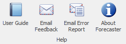

# Home Tab - Help Section

The Help section of the main ribbon's Home tab provides a range of help options, ranging from filing error reports to version information. It holds four buttons as shown below.

| Buttons            | Description                                                                                                       |
|--------------------|-------------------------------------------------------------------------------------------------------------------|
| User Guide         | Link to this online Forecaster User Guide                                                                         |
| Email Feedback     | Should you have any queries or suggestions, you can email us at CACI by clicking on the **Email Feedback** button |
| Email Error Report | If Forecaster throws an error, you can send CACI an automatically generated error report by clicking here         |
| About Forecaster   | To show details of the current Forecaster version, your current licensing status, and the Forecaster licence key. |

The email functionality here has certain requirements on the way your email is set up, so may not always be available. You can however always contact CACI directly using forecasting@caci.co.uk.
