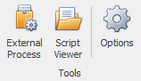
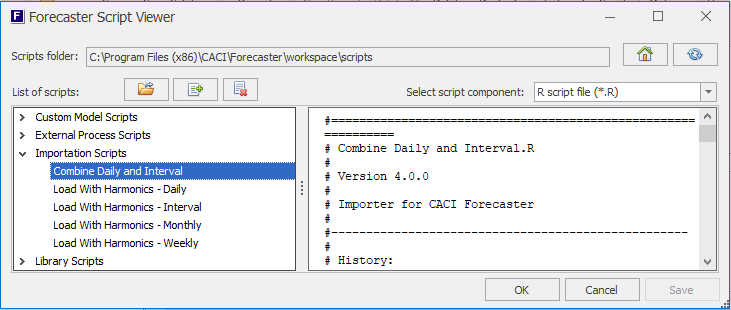
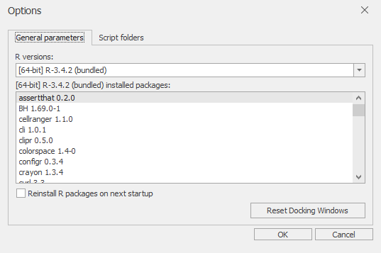

# Home Tab - Tools Section

The Tools section of the main ribbon's Home tab provides a range of tools for viewing scripts (Forecaster uses these typically for importing and exporting data, as well as providing all the forecasting models) and managing settings. It holds 3 buttons as shown here.

The following sections cover the operation of these 3 buttons

## External Process
External Processes are typically used for exporting data from Forecaster, or producing diagnostics or reports.  Forecaster ships with 3 standard script out of the box (as described below).  However, additional scripts can be created by CACI for customised operations such as exporting in specific formats, producing reports, or pushing data to databases.  Feel free to contact CACI if you're spending too much time manually exporting or combining data from Forecaster - a custom External Process may well be the best way of automating that process.  External Processes can also be created by any users familiar with the R environment.

Clicking the **External Process** button brings up a dialog box where you can chose the available external processes from a drop down box.  (External Processes can also be run by right-clicking on the project in the Solution Explorer, then selecting *External Process*.)  Forecaster ships with 3 custom scripts: *Export Data*, *Export Project Data*, and *R Diagnostics*. These are described in detail [here](External-Processes/External-Processes.md).

## Script Viewer

The Script Viewer allows direct viewing of the underlying R and xml files that provide importation, modelling, and external process functionality in Forecaster.  This process is usually only used for system validation and updating purposes.

The Script Viewer is brought up from the **Script Viewer** button in the *Tools* section of the *Home* tab.

The low level detail on any of Forecaster's data importers, forecast models, and external processes can be viewed here.  A drop-down lets you select whether to view the R scripts or supporting xml files. Scripts can also be imported or removed from this tool.  (Adding or removing scripts can also be done by directly adding or removing script R and xml files to the scripts folder.)

## Options

Clicking on The **Options** button from the *Tools* section of the *Home* ribbon brings up the *Options Dialog* shown below. This dialog lets you view and change a range of options, mainly concerning the R environment. These options are all reasonably technical, and generally should only need changing in quite unusual circumstances.

<!-- Update picture with 2 tabs -->

This *Options* dialog has 2 tabs:

### General Parameters

This tab displays information on the R version being used by Forecaster, as well as the packages that are currently installed. The R version cannot be changed, as it comes bundled with Forecaster (the R version shown here will have '(bundled)' after its name). The text box below will show a list of all installed R packages. 

#### Installing additional R packages
Forecaster comes with a range of R packages already pre-installed. Additional packages can be loaded by simply dropping the package zip files into the *rpackages* subfolder of the scripts folder (this is defined in the following tab *Script folders*). For a default installation, this is  *C:\Program Files (x86)\CACI\Forecaster\workspace\scripts\rpackages*. These new packages will be installed the next time Forecaster is restarted. Administrator privileges are required during this restart, in order to get those new packages installed. Once a package is loaded, its zip file can then be removed from the *rpackages* folder.

#### Reset Docking Windows
The **Reset Docking Windows** button in the bottom right of this dialog can be used to reset the status of Forecaster's various windows (such as the Output or Solution Explorer windows). This can be useful for instance if windows have been minimised, or moved to unusual locations when using multiple monitors.

### Script folders
The *Script folders* tab of the *Options* dialog holds the folder locations for the script files (as seen in the previous tab), as well as a data folder. These values would only need changing in unusual deployment scenarios.

