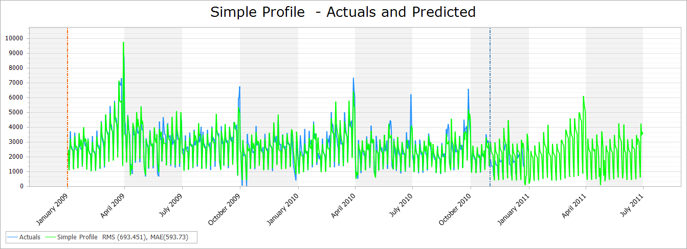
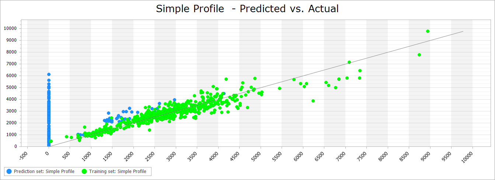

# Charts and Error Metrics

The data can be viewed in two different chart types; a time series plot or a scatter plot, examples of both are shown below.

For the Time Series Chart, the legend contains error metrics for each forecast project or snapshot so that the user can assess the performance of each forecast when compared to the actuals.  The three error metrics are root mean square, mean absolute error and PE and are calculated for the validation set only.

| Error Metric                                                                                        | Formula | Description                                                                   |
|-----------------------------------------------------------------------------------------------------|:---:|-------------------------------------------------------------------------------|
| **Root Mean Square (RMS)**                                                                              |   $$\sqrt{\frac{1}{n}  \sum_{i=1}^n(f_i-\alpha_i)^2}$$      | The square root of the average of the squared errors                          |
| **Mean Absolute Error (MAE)**                                                                          |   $$ \frac{1}{n} \sum_{i=1}^n \left\lvert{f_i-\alpha_i}\right\rvert$$      | The average of the absolute error (i.e. the error with  the +/- sign removed) |
| **Peak Error (PE)**                                                                                     |   $$ max_{i=1, n} \left\lvert{f_i-\alpha_i}\right\rvert $$      | The largest absolute error                                                    |

Where $$n:=$$ number of observations in the validation set,  $$f_i:=$$ forecasted value for observation $$i$$, $$\alpha_i:=$$ actual value for observation $$i$$.