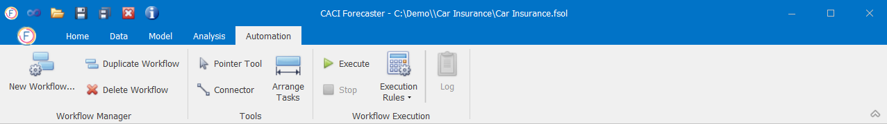

# Automation

The last item on the application ribbon is the Automation tab. This tab gives the user the tools to automate the whole forecasting process by creating **workflows**. Workflows are used to create a project, import the data, setup models, generate the forecasts and export the results.

Workflows are used to automate common tasks such as creating a project, re-importation, model re-training, and data export. Workflows are far faster to run, and minimise the potential for error. With Workflows, multiple projects can be created at the same time.

To learn how to Create Workflows, click the following link:


To learn how to Run Workflows, click the following link:


To find information about Creating Projects with Workflows, click on the link below:

