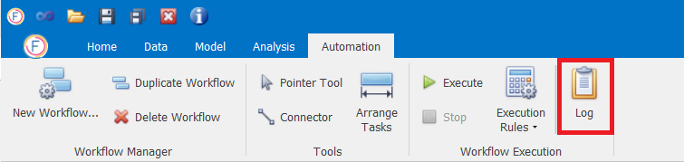
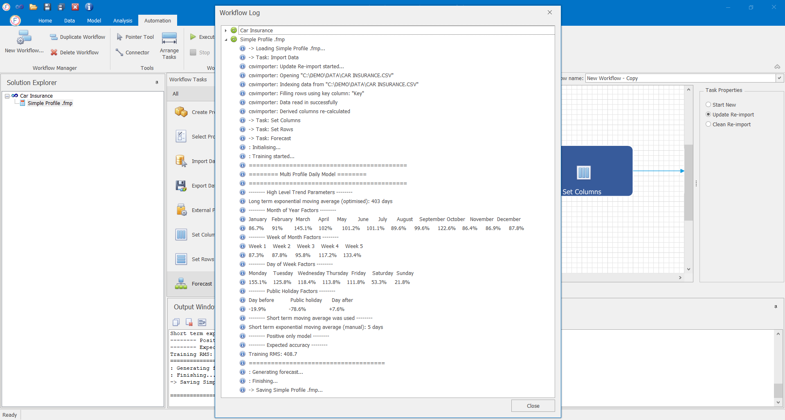

# Running Workflows

## Running Workflows

Once the Workflow has been created users can run it by clicking on the **Execute** button as in depicted in the image below.

There is also a functionality to **Stop** a running workflow. Users can also specify the desired **Execution Rules** in case of error during the execution

## Execution Log

After executing a workflow, users are able to see the **Log** by clicking on the relevant button as displayed in the following image. 

