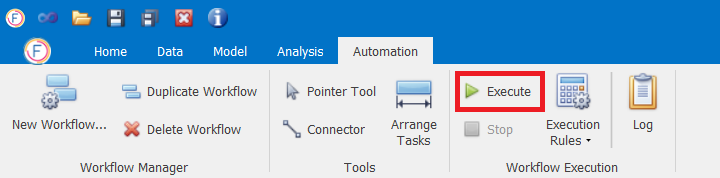

# Running Workflows

## Running Workflows

Once a Workflow has been created you can run it by clicking on the **Execute** button as in shown below.

You can also stop a running workflow with the **Stop** button. **Execution Rules** let you decide what action to take in case of an error within a workflow step. The options are:

**1. Continue Run:** This will ignore the error, and keep on running the next workflow steps within the current project. This is selected by default.

**2. On Error Halt Project Execution:** This will stop any processing on the current project, and move to the next project in the workflow

**3. On Error Halt Workflow Execution:** This will stop the workflow completely, and will do no more processing on this or any other projects

## Execution Log

After executing a workflow, you can view the log by clicking on the **Log** button as shown below. 

