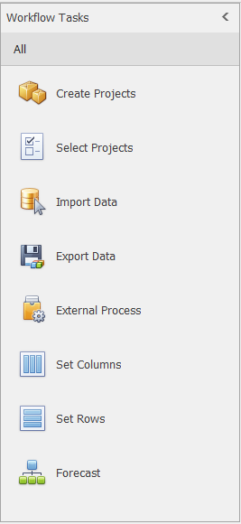
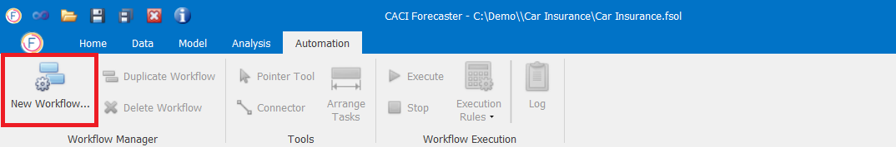
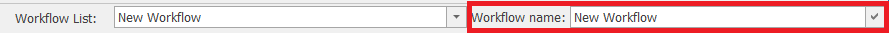
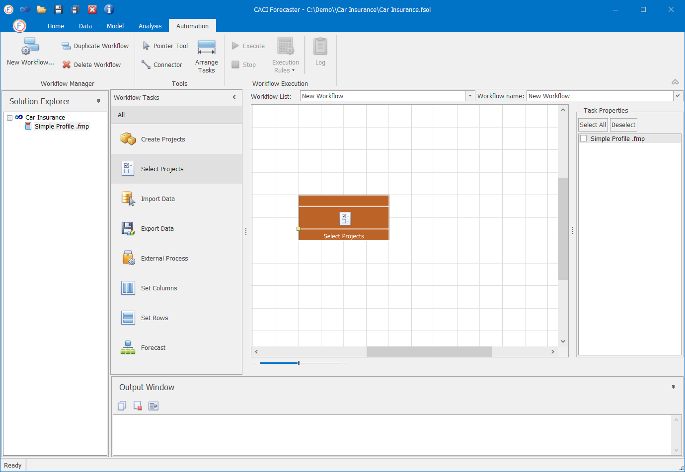
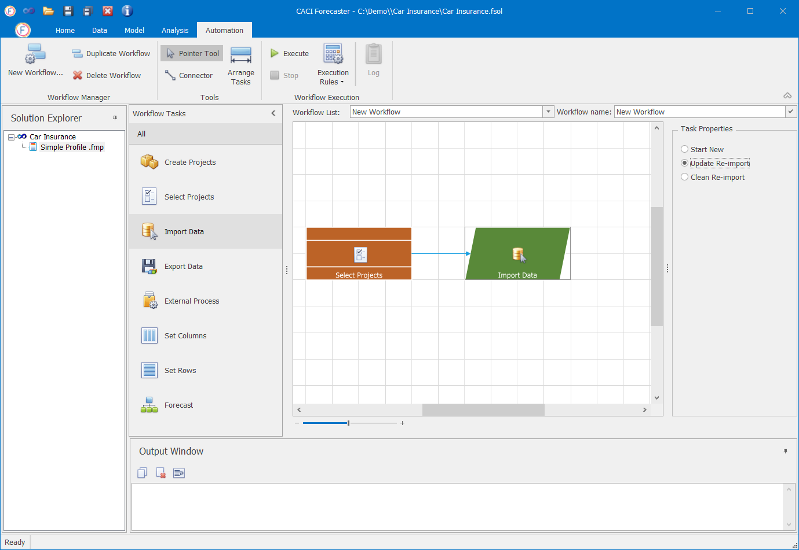
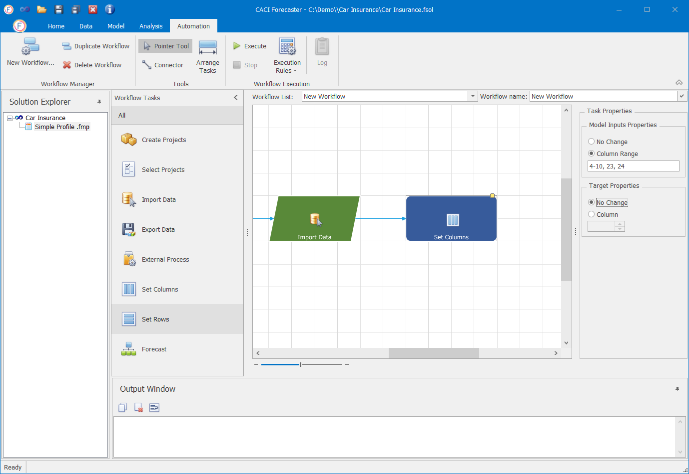
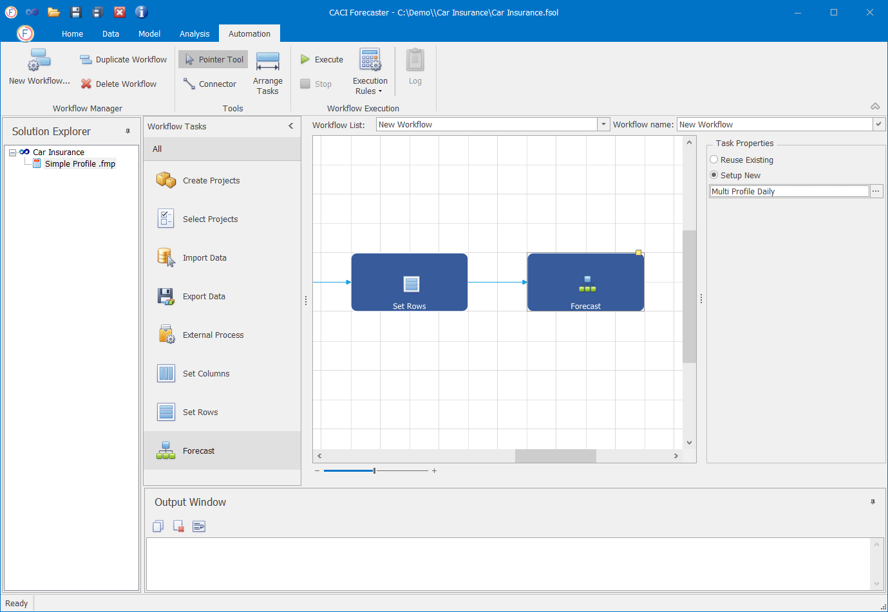
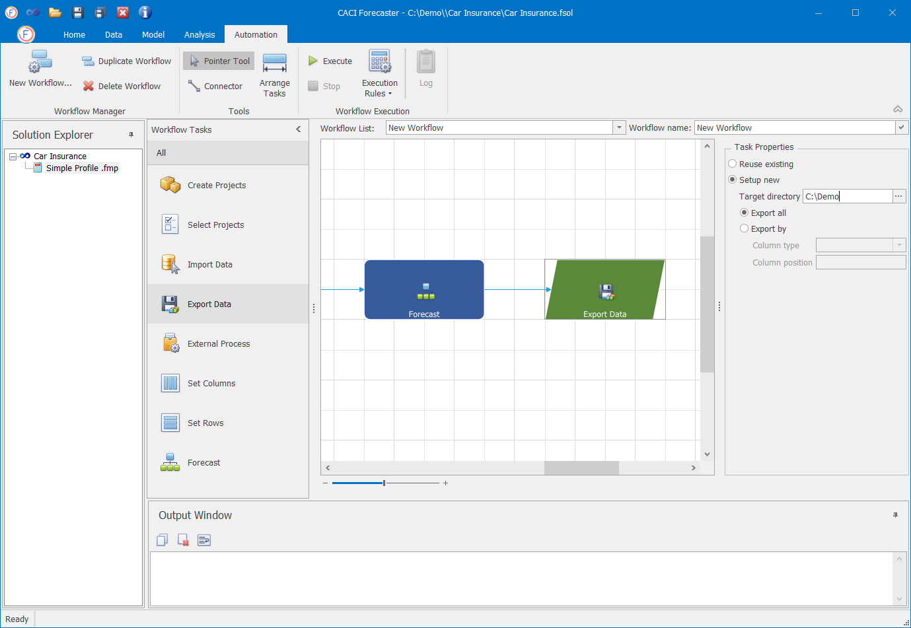
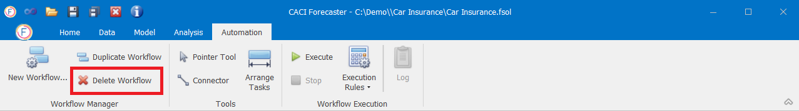

# Workflows

## Workflows

Workflows are used to automate common tasks such as creating a project, re-importation, model re-training, and data export. Workflows are far faster to run, and minimise the potential for error. With Workflows, multiple projects can be created at the same time.

This guide explains how to manage Workflows in Forecaster.

## Workflow Tasks

A Workflow is made up of a series of Workflow Tasks . A Workflow Task is a specific action that can be performed within Forecaster and used in the Automation to build a Workflow. The output of a Workflow Task is used as input of the next one.

The available Workflow Tasks are shown below:

 

### Add Workflow Task

Workflow Tasks can be added by simply dragging and dropping them from the Workflow List to the main workflow pane. When a Workflow Tasks is added into the pane, it is automatically added at the end of the workflow and connected with the last Workflow Task.

### Delete Workflow Task
To delete a Workflow Task select the task and press the `delete` key.

## Creating a Workflow

To initialize a new workflow, click on the **New Workflow** button under the Automation tab, as in the image below.

The title of a Workflow can be changed from the *Workflow name* field.

Once the Workflow has been initialized, you can start building up a sequence of Workflow Tasks. The next sections describe each one of them in detail.

### Select Projects

To build a new workflow, you can either start from the Create Projects or Select Projects tasks. The Create Projects is used when you have a custom importation process created by CACI. Otherwise, the Select Projects task should be selected.

The Select Projects option is used in order to re-use one or multiple existing Project(s) of a Solution. To do so, simply drag the Select Projects task into the main workflow pane.

When the Select Projects task is selected, a list of the Solution's Projects appear in the right-hand pane. You can select one or multiple Projects to include in the workflow.

### Create Projects

As already mentioned, to build a new workflow you can either start from the Create Projects or Select Projects tasks. If you have a custom importation process built by CACI then you have to start from the Create Projects task. The Projects will be created based on the defined categories in the custom importation process.

### Import Data

The Import Data task is used to import data.

From the Task Properties pane you can specify a new importation procedure, re-use of the existing one by updating the current importation configuration (i.e. data file, script) or re-use of the existing one with a clean import.

### Set Columns

At the Set Columns task you can specify the target column of the model as well as the model inputs. When the *No Change* option is selected, the project's existing configuration is used with no change.

### Set Rows

At the Set Columns task, you can specify the starting date and the length of the forecasting period.

### Forecast

At this step of the workflow you are able to select the predictive model to be used for the forecast. You can either re-use the model selected within the project or setup a new one. By clicking on the "..." button right next to the model, the Model Parameters screen appears where you can also define or amend the model's parameters.

### Export Data

The Export Data task is used to export the results of a workflow and save them into the user's computer. From the properties pane you can setup a Target Directory where the file will be saved.


The Target Directory can be a network folder so the results can be directly shared with others.


## Duplicate workflow

To create a copy of a workflow click on the **Duplicate Workflow** button as shown below.

## Delete Workflow

To delete a workflow click on the **Delete Workflow** button as shown below.

