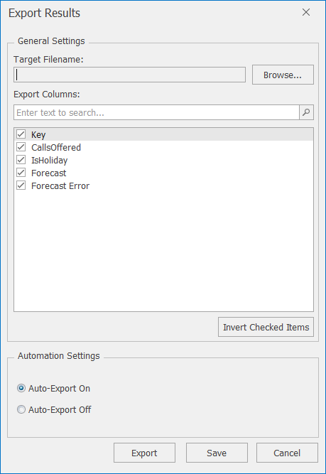

# Data Exporters

To export the data, first click on **Text** and then **Export Results** so that the dialog as in the image below appears.  

The following tables describe the various settings and buttons available in the Export Results screen.

Export Results Settings:
| Setting             | Description                                                                                                                                                                                                      |
|---------------------|------------------------------------------------------------------------------------------------------------------------------------------------------------------------------------------------------------------|
| Target Filename     | Path and file name of the csv file where the data will be exported to.  The csv file can subsequently be opened in Excel if required.                                                                            |
| Export Columns      | Enables you to select the variables that you want to include in the export                                                                                                                                       |
| Automation Settings | By selecting **Auto-Export On**, the latest data will be exported to the specified file each time you generate a forecast.  If you only wish to export the data once, select **Auto-Export Off**, then the **Export** button |

Export Results Buttons:

| Option | Description                                                                                                                           |
|--------|---------------------------------------------------------------------------------------------------------------------------------------|
| Export | Exports the data and saves the latest settings for future use                                                                         |
| Save   | Saves the latest settings for future use.  If **Auto-Export On** is selected, the data will be exported next time you generate a forecast |
| Cancel | Closes the Export Results window without saving changes                                                                               |
