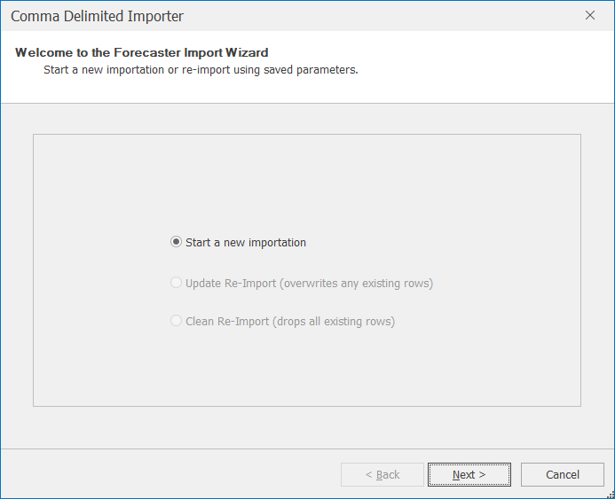

# Data Importers

Forecaster is designed to read in and work with time series data. This is data that has an explicit (usually time based) ordering. This order is defined by a key column, typically a date or date-time column. 


Unordered data can also be read in to Forecaster - for this kind of data Forecaster can automatically create a dummy key column. Models such as Regression or Random Forests that are not limited to time series forecasting can then be applied. Random Forests can also be used to build propensity models, for example for forecasting churn rates or marketing response rates.


Data can be imported via three different importers; *Text*, *Excel*, and *Script*. The Text and Excel importers read in data pretty much as is, with very little additional processing. The *Script* importers are the most useful and commonly used importers, and can be used to add in additional public holiday and seasonal information when reading in data.

1. **Text:**
Used to import a text file, for example .csv. This reads in the data as is, with very little additional processing.

2. **MS Excel:**
Used to import an Excel file. This reads in the data as is, with very little additional processing.

3. **Script:** 
This the most commonly used way of reading data into Forecaster. There are two main types of script: 

    - Load with Harmonics scripts: These let you import from flat files such as csv files, while appending useful information on public holidays and harmonics (to help model seasonality). A range of scripts is available in order to load interval, daily, weekly, or monthly data.
    - Bespoke importation scripts: These can be created by CACI (or by users with R knowledge) in order to import specific business data. For instance, these could be set up to read directly from a database, as well as merging in data from reports and local flat files. To find out more, please contact CACI directly.

 
Once you've selected a particular importer (Text, Excel, or Script), click on Import to open the importation wizard.

The following sections will describe how to import data into a new project, using the three different importers. You can cancel the import at any time by pressing the **Cancel** button. If at any point you need to change some wizard settings press the **Back** button to go back a step through the importation wizard process.


You can click on any of the sections of this page from the CONTENTS menu to the right, which can be faster than scrolling down the page.


## Text Importer
Once you've selected *Text*, then clicked **Import** on the *Data Importers* section of the ribbon, the Comma Delimited Importer will open.  If this is a brand new importation, the only option available is to start a new importation. 

<!-- TO DO: Details on various types of importation -->

After clicking on Next, the next dialog lets you browse for the file to be read in. The default delimiter is a comma, but other delimiters can also be selected (as shown in the image below).  
Forecaster will automatically detect the datatype for each column. By default, it scans the first 10,000 rows, but this can be changed if needed. Scanning fewer rows would make importation slightly quicker, while scanning more rows would be more robust, in case for instance a different data  type turns up later in the file. (These automatically inferred datatypes can be altered manually, either later on in the importation importation, or within the data grid on the *Data* tab after the data has been read in). 

The *Quote character* box lets you select the character to be used to identify text.

Clicking on Next brings you to the Column Configuration dialog where you can see a preview of the data, with the column identified as the key highlighted in blue.  This text importer assumes that the first column contains the key (usually a date or date-time).  However, if this first column contains duplicate values, an auto-generated key column will be created instead.  If you'd prefer to use an auto-generated key column instead of the default first column, tick the *Auto-Generate Key Column* option.
 

By clicking the *Advanced* view (as shown below), you can adjust the data type of each column if needed.
 

| Data Type | Description                                                                 | Additional information                                                                                                                                                                                     |
|-----------|-----------------------------------------------------------------------------|----------------------------------------------------------------------------------------------------------------------------------------------------------------------------------------------------------------------------------------------------------------------------------------------------------------------------------------------------------------------------------------------------------------------------------------------------------------------------------------------------------------------------------------------------------------------------------------------------------------------------------------------------------------------------------------------------|
| Double    | A real or continuous number, i.e. a number with decimal places (e.g. 1.234) | - *FormatDecimals*: Set the number of decimal places  - *FormatThousands*: Use a comma to separate thousands                                                                                                                                                                                                                                                     |
| Integer   | A whole number, such as 1, 2, 3, or 4                                          |        None                                                                                                                                                                                                                                                                                                 |
| DateTime  | Either dates or datetimes                                    | - *FormatDateTime*: Define whether the variable is a date, time or date and time    - *IncrementType*: This can be one of Daily, Weekly, Monthly, or Minute, depending on the data   - *IncrementStep*: This sets the frequency of the *IncrementType* value.  For example, for daily data, *IncrementType* should be to be *Daily* and the *IncrementStep* should be 1. If the data is recorded once every two weeks, then the *IncrementType* should be *Weekly* and *IncrementStep* set to 2 
| String    | For text columns     |      None     |

Clicking Next followed by Finish completes the importation.

## Excel Importer
Once you've selected *Excel*, then clicked **Import** on the *Data Importers* section of the ribbon, the Excel Importer will open.  If this is a brand new importation, the only option available is to start a new importation. 
 
 

After clicking on Next, the next dialog lets you browse for the Excel file.  By leaving the Suggest Data Types box ticked, Forecaster will automatically define data types for each column.  
 

The following screen will ask you to select the relevant worksheet within the Excel file.
 
 <!-- TO DO: Sort out Excel importation bug (TSF-503), add image -->
Excel Import Wizard - Sheet Selection

Clicking on Next will bring you to the Column Configuration screen.  The importation will then complete by clicking on Next followed by Finish.

## Script Importer
Once you've selected *Script*, then clicked **Import** on the *Data Importers* section of the ribbon, the Script Importer will open.  
 

After clicking **Next**, the next dialog lets you select a particular Script Importer from a drop-down, and view and alter any parameters if needed. 

The standard way of reading data into Forecaster is using one of the *Load With Harmonics* script importers. These append a range of useful additional data to any data import, including public holiday information for a range of countries. Simply choose the importer that matches the data you're reading in, whether that's interval level, daily, weekly, or monthly. 


Additional customised importation scripts can also be created, in order to read, combine, or aggregate data from any range of files, data feeds, or databases. These can be created by CACI (or by users with R knowledge) in order to import specific business data. For instance, these could be set up to read directly from a database, as well as merging in data from reports and local flat files. To find out more, please contact CACI directly.


 

After clicking on Next, progress of the importation will be visible in the import wizard, similar to that shown in the image below.

Clicking on Next will bring you to the Column Configuration screen which is described in section 5.1.1.  The importation will then complete by clicking on Next followed by Finish.

## Re-importing data

When new data becomes available, it is generally worth re-importing this data, to update both the forecasting model and the resulting forecasts by taking into account the very latest data. The quickest way of re-importing data is to use the **Quick Re-import** button; this will re-import from the original data source, bringing in any new changes that may be present. 
If you want more control over the re-importation process (e.g. to change the number of harmonics), you can instead click the **Import** button, which will take you through the importation wizard you used when you first set up the project. Typically you'll want to leave most of the parameters unchanged, but this does give you the flexibility to alter any aspect of the importation.

The import process will then make use of the key column.  It is assumed that the import file will be the same as the original file, that its format is the same, the column positions of each variable are the same, and that their types remain constant.  The key variable is used to overwrite any values in the data grid with values from the import data.  Therefore if you have historical data that has been changed in Forecaster but not reflected in the source data, the modified values will be overwritten with the original values. 
 
If Update Re-Import is selected, then any rows with key values not visible in the new source data will remain unchanged.  For example, if your import data file only contains data from March 2011, yet the data grid in Forecaster contains data from January 2011, then the updated data grid will contain data from January 2011, with the values from March 2011 taken from the new import file.  To prevent this from happening (and therefore only include the new source data in the data grid), select Clean Re-Import instead.

