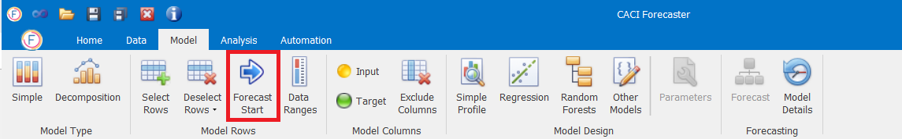
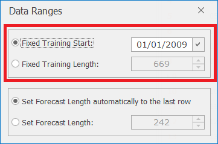
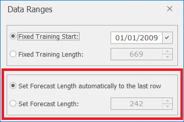

# Model Rows

The next step is to define the row on which training data ceases and forecast data starts (this is called the forecast start point).  When developing a time-series model, it is good practice to measure the predictive performance of the model by holding back some of the data.  Typically this is from the most recent period of historical data, since it is more likely that this data is more representative of the future unknown activity.  (This subset of data is is often referred to as the validation set.)

### Forecast Range
When developing forecasts to evaluate the quality of the forecast, select a forecast start point which is at least X steps behind the last recorded target value, where X is the number of steps ahead that you usually need to forecast.  This will allow the quality of the forecast to be evaluated over the full period for which the forecast is required.

To specify the forecast start point, scroll to the appropriate row in the data grid, highlight the row number and press the **Forecast Start** button in the *Data – Model Rows* ribbon.  The highlighted row will turn dark green to make the start point obvious when scrolling through the data.  Only one start point can be assigned at a time.  If the user reassigns the start point, any previously existing ones will be deleted.

<!-- You now need to define how many rows are included in the forecast range.  This can be done by clicking on the **Data Ranges** button in the Data – Model Rows ribbon and then updating the Forecast Length.  If you want to set the forecast range to run until the end of the data set, type in a very large number (e.g. 99999).  The application will automatically change this to the exact number of rows between the forecast start and end point. -->
  

### Training Range
In some situations, you may not want to include the earlier historical data when training the forecast model.  CACI Forecaster lets you change the training dataset easily, without the need for you to delete rows from the original input file.

The training data set can be selected in two ways:

- To specify a fixed training data start point:
    - Scroll to the appropriate row in the data grid, highlight the row number and click on the **Data Ranges** button
    - Click the tick symbol next to *Fixed Training Start* to update the training starting point to the currently selected row

- To specify a fixed training length (for example, if you always want to use 2 years’ worth of data in the training set):
    - Select *Fixed Training Length* and change the number to the fixed number of rows you want included in the training data set
    

### Forecast Range

Similarly, the forecasting data set can be selected in two ways:

- To specify the forecast data set until the last row.
- To specify a fixed forecasting length (for example, if you always want to forecast a month ahead)

### Selecting/Deselecting Rows
As well as selecting columns for the model, Forecaster lets you deselect and reselect individual rows of data.  Deselecting rows could be necessary because of missing values or because certain rows contain unusual data which you wouldn't want a forecast model to use.  

<!-- #### Selecting/deselecting specific rows -->

Selecting or deselecting a row can be done in two different ways:

- Left-click the row number of interest and then click on either the **Select Rows** or **Deselect Rows** buttons in the *Data – Model Rows* ribbon.  Multiple rows can be selected using the `shift` key.
- After selecting at least one row, right-click on a selected row number and choose **Select/Deselect** from the list of options

You may have a dataset that contains zero or missing values on the variable that you wish to forecast.  Once you have set the target column (as described in next section - [Model Columns](Model-Columns.md#column-types)), you can deselect any blank or zero target values in a couple of steps:

- Select all rows by clicking on the blank column heading above the row numbers
- Right-click on any row number so that the list of row options appears.  Select **Deselect Blank Targets**
- Repeat the steps above and select **Deselect Zero Targets**
