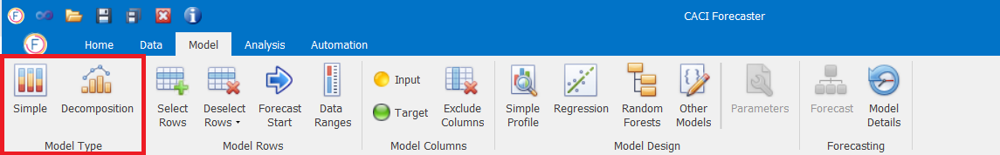

# Model Type

Forecaster lets you create two different types of forecast:

-	Simple model: For using a single forecast model
-	Decomposition model: A combined model, which lets you run two different forecasting methods on different parts of the data.  One particular use for this is to split your data into trend and seasonal components, enabling you to use a different forecasting method on each component before re-combining the two to form the final forecast

<!-- A separate document describing decomposition models can be obtained by CACI [1]. -->
