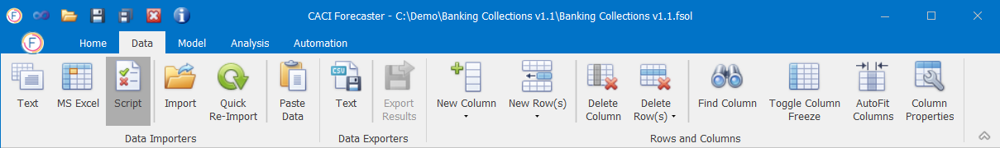
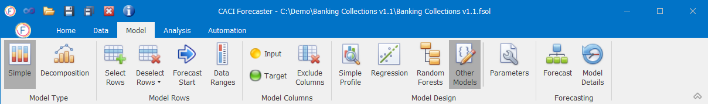
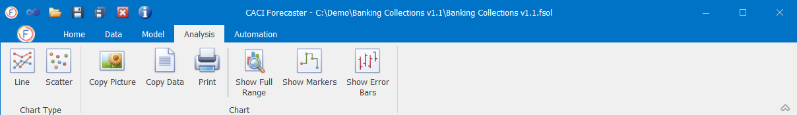
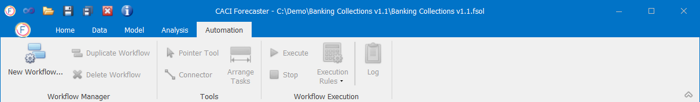
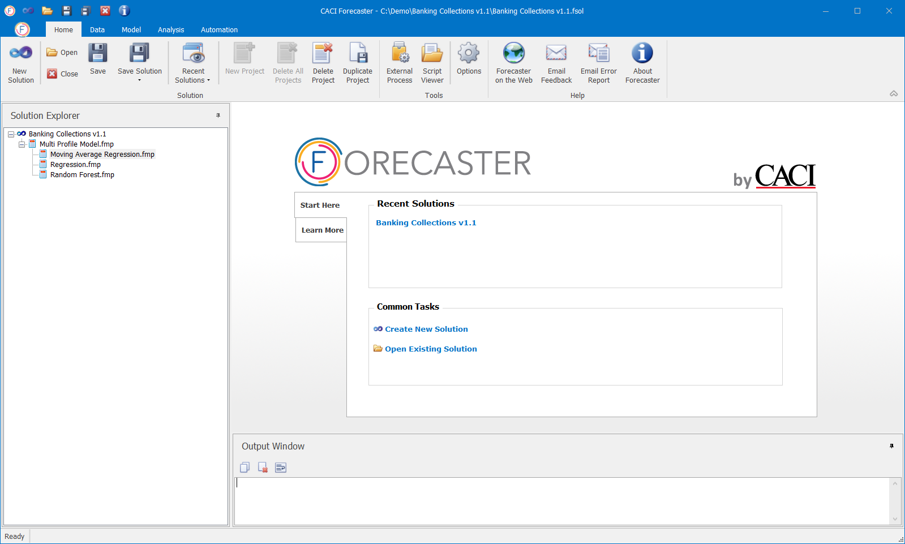

# Navigation

## Navigation Tabs
The application makes use of a ribbon tool bar and has been broken down into the following sections:

* **Home**:  This tab contains all of the controls required to manage the solution (the current CACI Forecaster file) and to automatically export the data

* **Data**:  This tab contains all of the functionality necessary to import data and pre-process it.

* **Model**:  This tab contains all of the functionality necessary to specify a forecasting technique and build the forecast.

* **Analysis**:  This tab holds chart for comparing the results of one or more forecasts.

* **Automation**: This tab is for automating the forecasting process by creating workflows that can create a project, import the data, setup models, generate the forecasts and export the results.



There is a natural order to building the forecasts, generally speaking the user will start with the Home tab, move to Data, then to the Model and Analysis, and finally onto the Automation for productionising the process.  However, the user is able to move around the application as they see fit, adapting forecasts and updating results.  Also within the ribbon control, the general mode is to move from left to right.

The Solution Explorer window (generally to the left of the screen) shows details of all available projects within the solution and is visible in all tabs.

#### Custom Actions
If required, CACI can provide bespoke scripts to generate output in specific formats.  For more information on additional consultancy, please contact CACI using the details in section 9.

#### Help
The Home – Help ribbon consists of three icons described in Table 3.

| Icon                  | Description                                                                                         |
|-----------------------|-----------------------------------------------------------------------------------------------------|
| Forecaster on the Web | Opens up the CACI Forecaster webpage which includes our contact details                             |
| Email Feedback        | Should you have any queries or suggestions, you can email us by clicking on the Email Feedback icon |
| About Forecaster      | Provides you with the details of your current version and license key                               |

#### Exit CACI Forecaster
To exit the application, press the standard window close button displayed in the top right hand side of the application.