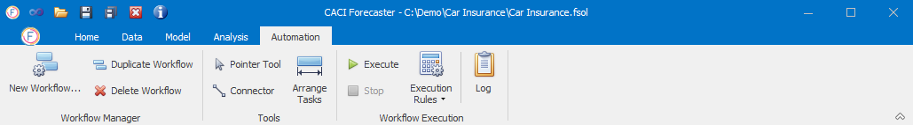

# Navigation

## Navigation Tabs
The application makes use of a ribbon tool bar and has been broken down into the following sections:

* [Home Tab](/user-guide/Home/Home.md) : This tab lets you manage the solution. This includes creating and managing both solutions and projects, as well as managing options and custom scripts. 

* [Data Tab](/user-guide/Data/Data.md) : This tab contains all of the functionality necessary to import data and pre-process it. and to automatically export the data

* [Model Tab](/user-guide/Model/Model.md) : This tab contains all of the functionality necessary to specify a forecasting technique and build the forecast.

* [Analysis Tab](/user-guide/Analysis/Analysis.md) : This tab holds forecast output charts.

* [Automation Tab](/user-guide/Automation/Automation.md) : This tab is for automating the forecasting process by creating workflows that can create a project, import the data, setup models, generate the forecasts and export the results.

There is a natural order to building the forecasts, generally speaking the forecasting process starts with the Home tab, moves to Data, then to the Model and Analysis, and finally onto the Automation for productionising the process.  This follows the order of the ribbon tabs from left to right. However, you can move around the application as you see fit, adapting forecasts and updating results.  

## [Solution Explorer](/user-guide/Getting-started/Solution.md)
The Solution Explorer window (generally to the left of the screen) shows details of all available projects within the solution and is visible in all tabs.



#### Custom Actions
If required, CACI can provide bespoke scripts to generate output in specific formats.  For more information on additional consultancy, please contact CACI using the details in section 9.

#### Help
The Home – Help ribbon holds four buttons as described below.

| Buttons                  | Description                                                                                         |
|-----------------------|-----------------------------------------------------------------------------------------------------|
| User Guide | Link to the online Forecaster User Guide                             |
| Email Feedback        | Should you have any queries or suggestions, you can email us by clicking on the **Email Feedback** button |
| Email Error Report        | If Forecaster throws an error, you can send us an automatically generated error report by clicking here. |
| About Forecaster      | Provides you with the details of your current version and license key                               |

#### Close CACI Forecaster
To close the application, press the standard window close button in the top right hand side of the application.