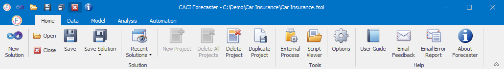

# Navigation

This section introduces the overall layout of Forecaster, and how to navigate around its various components.

## Navigation Tabs
Forecaster is based around 5 main ribbon tabs, across the top of the screen. Generally the operation goes from left to right, following the order of these tabs. You typically would create a new solution in the Home tab, import data in the Data tab, build a forecast model in the Model tab, view the forecasts in the Analysis tab, and then automate the whole process if needed in the Automation tab. However, you can of course move around the application as you see fit, adapting forecasts and updating results.  

* [Home Tab](/user-guide/Home/Home.md) : This tab lets you manage Forecaster solutions and and projects, as well as controlling options and custom scripts. 

* [Data Tab](/user-guide/Data/Data.md) : This tab contains all of the functionality necessary to import data and pre-process it, as well as exporting data.

* [Model Tab](/user-guide/Model/Model.md) : The core of Forecaster, this tab is all about defining your forecasting model and creating the forecasts.

* [Analysis Tab](/user-guide/Analysis/Analysis.md) : For viewing the forecasting charts

* [Automation Tab](/user-guide/Automation/Automation.md) : This tab lets you set up workflows in order to automate parts or even all of the forecasting process. You might use these to perform operations across a range of forecasts, for example creating new projects, importing data, setting up models, generating forecasts and exporting the results.

## [Solution Explorer](/user-guide/Getting-started/Solution.md)
The Solution Explorer window (usually to the left of the screen) shows details of all available projects within the solution. The Solution Explorer is visible in all tabs.



