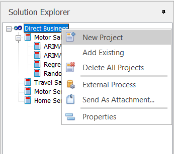
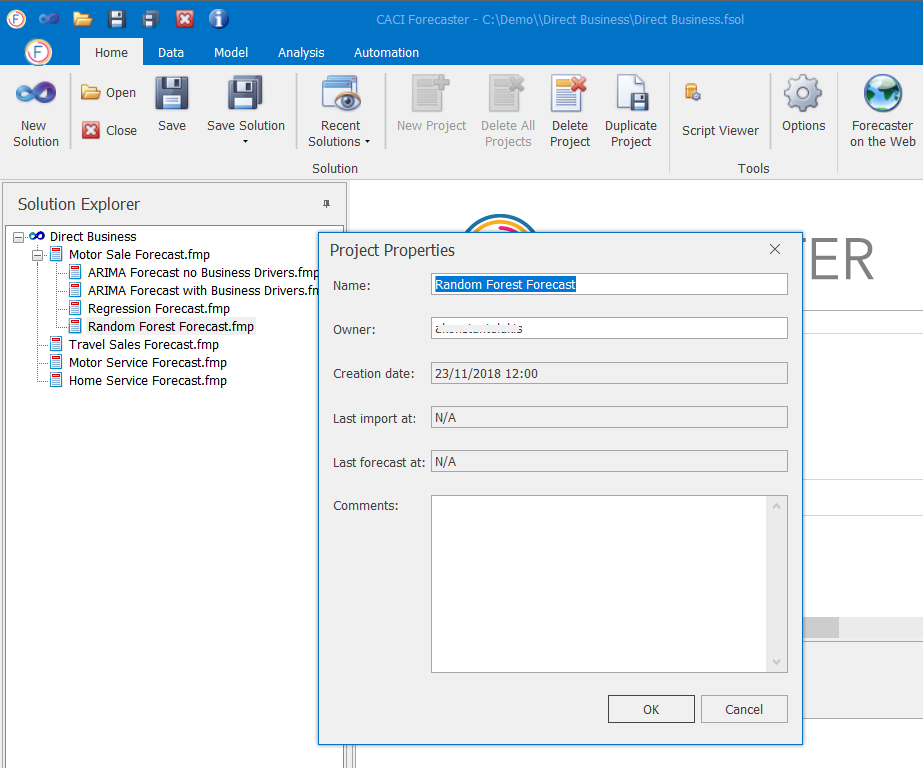
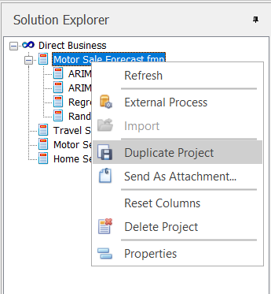
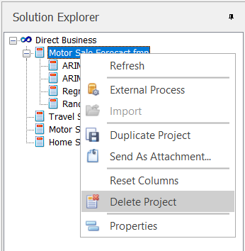

# Projects

The following section explains how to manage your **Projects** in the Solution Explorer.  Once a solution has been created, there are number of management activities which can be carried out on projects within the solution.  Details are as follows:

## New Project
To create a new project, select the **New Project** icon from the **Home** tab.  The user is then expected to load data and build a model in the usual manner.

Alternatively, right-click on the solution name and select **New Project** from the solution options as shown in the image below. 
 

## Project Properties - Project Name
To change the name of any project or snapshot within a solution, right-click the item of interest from the Solution Explorer view and then select the **Properties** option.  The system will then display a dialog to allow you to change its name, as shown in the image below.  It will also give you the opportunity to add some comments to the project should this be required.  Additionally information on the creation date and time and creator of the forecast or project will be displayed.

## Duplicate Project
A project snapshot is a way of making an exact copy of an existing project. To show the connection between the two projects, the copy is placed under the original project from which the copy was generated.  Please note that if there are any subsequent changes to the originating project, the changes will not be inherited by the previously defined copies.

To create a copy of a project, right click on the relevant project and then select the **Duplicate Project** option.

A copy of the project, including data, model and settings, will be created under the current project.  


A project duplicate can be repeated for as many levels as the user wishes, thus creating a comprehensive range of forecast projects and results.  Once all experimentation is complete, the best forecast can be selected.


## Add Existing Project
The CACI Forecaster permits the user to take a project from one solution and insert it into another.  This might be useful when consolidating forecasts from a number of different sources to create the ‘operational’ versions after a period of investigation.

To add an existing project to the current solution, right-click on the solution name in the Solution Explorer and select **Add Existing** from the list of options.  This will then open up a navigation window to allow you to locate the forecast of interest.  If you attempt to import a project with a name that already exists in the current solution, the system will ask you whether you wish to overwrite the existing project.  If you select no then the import process will be cancelled.

## Delete Project
A project can be deleted via the Solution Explorer by right-clicking on the relevant project and choosing **Delete Project**. Confirmation will be sought that you really do want to delete all components of the data.  Be aware that the project that will be deleted is the one that is currently active. 

